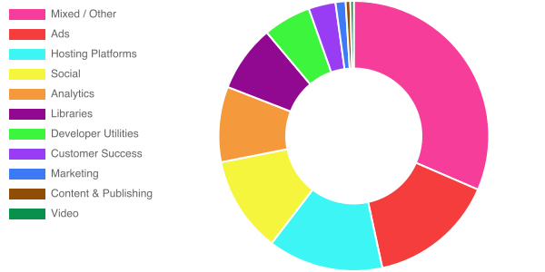

# [Third Party Web](https://www.thirdpartyweb.today/)

## Check out the shiny new web UI https://www.thirdpartyweb.today/

Data on third party entities and their impact on the web.

This document is a summary of which third party scripts are most responsible for excessive JavaScript execution on the web today.

## Table of Contents

1.  [Goals](#goals)
1.  [Methodology](#methodology)
1.  [NPM Module](#npm-module)
1.  [Updates](#updates)
1.  [Data](#data)
    1.  [Summary](#summary)
    1.  [How to Interpret](#how-to-interpret)
    1.  [Third Parties by Category](#by-category)
        1.  [Advertising](#ad)
        1.  [Analytics](#analytics)
        1.  [Social](#social)
        1.  [Video](#video)
        1.  [Developer Utilities](#utility)
        1.  [Hosting Platforms](#hosting)
        1.  [Marketing](#marketing)
        1.  [Customer Success](#customer-success)
        1.  [Content & Publishing](#content)
        1.  [CDNs](#cdn)
        1.  [Tag Management](#tag-manager)
        1.  [Consent Management Provider](#consent-provider)
        1.  [Mixed / Other](#other)
    1.  [Third Parties by Total Impact](#by-total-impact)
1.  [Future Work](#future-work)
1.  [FAQs](#faqs)
1.  [Contributing](#contributing)

## Goals

1.  Quantify the impact of third party scripts on the web.
1.  Identify the third party scripts on the web that have the greatest performance cost.
1.  Give developers the information they need to make informed decisions about which third parties to include on their sites.
1.  Incentivize responsible third party script behavior.
1.  Make this information accessible and useful.

## Methodology

[HTTP Archive](https://httparchive.org/) is an inititiave that tracks how the web is built. Every month, ~4 million sites are crawled with [Lighthouse](https://github.com/GoogleChrome/lighthouse) on mobile. Lighthouse breaks down the total script execution time of each page and attributes the execution to a URL. Using [BigQuery](https://cloud.google.com/bigquery/), this project aggregates the script execution to the origin-level and assigns each origin to the responsible entity.

## NPM Module

The entity classification data is available as an NPM module.

```js
const {getEntity} = require('third-party-web')
const entity = getEntity('https://d36mpcpuzc4ztk.cloudfront.net/js/visitor.js')
console.log(entity)
//   {
//     "name": "Freshdesk",
//     "homepage": "https://freshdesk.com/",
//     "categories": ["customer-success"],
//     "domains": ["d36mpcpuzc4ztk.cloudfront.net"]
//   }
```

## Updates

## 2021-01-01 dataset

Due to a change in HTTPArchive measurement which temporarily disabled site-isolation (out-of-process iframes), all of the third-parties whose work previously took place off the main-thread are now counted _on_ the main thread (and thus appear in our stats). This is most evident in the change to Google-owned properties such as YouTube and Doubleclick whose _complete_ cost are now captured.

## 2019-05-13 dataset

A shortcoming of the attribution approach has been fixed. Total usage is now reported based on the number of _pages_ in the dataset that use the third-party, not the number of _scripts_. Correspondingly, all average impact times are now reported _per page_ rather than _per script_. Previously, a third party could appear to have a lower impact or be more popular simply by splitting their work across multiple files.

Third-parties that performed most of their work from a single script should see little to no impact from this change, but some entities have seen significant ranking movement. Hosting providers that host entire pages are, understandably, the most affected.

Some notable changes below:

| Third-Party | Previously (per-script) | Now (per-page) |
| ----------- | ----------------------- | -------------- |
| Beeketing   | 137 ms                  | 465 ms         |
| Sumo        | 263 ms                  | 798 ms         |
| Tumblr      | 324 ms                  | 1499 ms        |
| Yandex APIs | 393 ms                  | 1231 ms        |
| Google Ads  | 402 ms                  | 1285 ms        |
| Wix         | 972 ms                  | 5393 ms        |

## 2019-05-06 dataset

Google Ads clarified that `www.googletagservices.com` serves more ad scripts than generic tag management, and it has been reclassified accordingly. This has dropped the overall Tag Management share considerably back down to its earlier position.

## 2019-03-01 dataset

Almost 2,000 entities tracked now across ~3,000+ domains! Huge props to [@simonhearne](https://twitter.com/simonhearne) for making this massive increase possible. Tag Managers have now been split out into their own category since they represented such a large percentage of the "Mixed / Other" category.

## 2019-02-01 dataset

Huge props to [WordAds](https://wordads.co/) for reducing their impact from ~2.5s to ~200ms on average! A few entities are showing considerably less data this cycle (Media Math, Crazy Egg, DoubleVerify, Bootstrap CDN). Perhaps they've added new CDNs/hostnames that we haven't identified or the basket of sites in HTTPArchive has shifted away from their usage.

## Data

### Summary

Across top ~4 million sites, ~2700 origins account for ~57% of all script execution time with the top 50 entities already accounting for ~47%. Third party script execution is the majority chunk of the web today, and it's important to make informed choices.

### How to Interpret

Each entity has a number of data points available.

1.  **Usage (Total Number of Occurrences)** - how many scripts from their origins were included on pages
1.  **Total Impact (Total Execution Time)** - how many seconds were spent executing their scripts across the web
1.  **Average Impact (Average Execution Time)** - on average, how many milliseconds were spent executing each script
1.  **Category** - what type of script is this

<a name="by-category"></a>

### Third Parties by Category

This section breaks down third parties by category. The third parties in each category are ranked from first to last based on the average impact of their scripts. Perhaps the most important comparisons lie here. You always need to pick an analytics provider, but at least you can pick the most well-behaved analytics provider.

#### Overall Breakdown

Unsurprisingly, ads account for the largest identifiable chunk of third party script execution.



<a name="ad"></a>

#### Advertising

These scripts are part of advertising networks, either serving or measuring.

| Rank | Name                                                                | Usage   | Average Impact |
| ---- | ------------------------------------------------------------------- | ------- | -------------- |
| 1    | [Bidswitch](https://www.bidswitch.com/)                             | 2,969   | 6 ms           |
| 2    | ContextWeb                                                          | 4,743   | 6 ms           |
| 3    | DeepIntent                                                          | 7,406   | 7 ms           |
| 4    | Beachfront Media                                                    | 2,012   | 9 ms           |
| 5    | RTB House AdPilot                                                   | 1,533   | 11 ms          |
| 6    | OneTag                                                              | 8,364   | 16 ms          |
| 7    | TripleLift                                                          | 4,566   | 21 ms          |
| 8    | [33 Across](https://33across.com/)                                  | 7,950   | 21 ms          |
| 9    | Sharethrough                                                        | 4,238   | 25 ms          |
| 10   | Constant Contact                                                    | 9,430   | 26 ms          |
| 11   | Yieldmo                                                             | 2,067   | 28 ms          |
| 12   | Tribal Fusion                                                       | 9,670   | 34 ms          |
| 13   | [AppNexus](https://www.appnexus.com/)                               | 57,074  | 40 ms          |
| 14   | Reklama                                                             | 2,448   | 41 ms          |
| 15   | SiteScout                                                           | 2,998   | 42 ms          |
| 16   | [Quora Ads](https://www.quora.com/business/)                        | 1,895   | 43 ms          |
| 17   | StackAdapt                                                          | 3,254   | 45 ms          |
| 18   | Sonobi                                                              | 3,294   | 49 ms          |
| 19   | bRealTime                                                           | 1,602   | 51 ms          |
| 20   | District M                                                          | 20,086  | 55 ms          |
| 21   | [OpenX](https://www.openx.com/)                                     | 14,601  | 56 ms          |
| 22   | GumGum                                                              | 23,926  | 58 ms          |
| 23   | Nend                                                                | 5,345   | 60 ms          |
| 24   | [The Trade Desk](https://www.thetradedesk.com/)                     | 12,628  | 63 ms          |
| 25   | BlueCava                                                            | 5,566   | 64 ms          |
| 26   | Twitter Online Conversion Tracking                                  | 2,759   | 66 ms          |
| 27   | MailMunch                                                           | 1,560   | 66 ms          |
| 28   | [F@N Communications](https://www.fancs.com/)                        | 1,660   | 72 ms          |
| 29   | Affiliate Window                                                    | 2,777   | 80 ms          |
| 30   | Intercept Interactive                                               | 2,401   | 81 ms          |
| 31   | [Scorecard Research](https://www.scorecardresearch.com/)            | 2,552   | 82 ms          |
| 32   | Drip                                                                | 1,479   | 83 ms          |
| 33   | Branch Metrics                                                      | 3,396   | 84 ms          |
| 34   | [Media Math](http://www.mediamath.com/)                             | 3,122   | 84 ms          |
| 35   | Gemius                                                              | 19,944  | 89 ms          |
| 36   | Between Digital                                                     | 3,938   | 98 ms          |
| 37   | Tynt                                                                | 83,849  | 99 ms          |
| 38   | DTSCOUT                                                             | 20,795  | 100 ms         |
| 39   | ExoClick                                                            | 2,089   | 102 ms         |
| 40   | OwnerIQ                                                             | 2,149   | 107 ms         |
| 41   | i-mobile                                                            | 12,272  | 107 ms         |
| 42   | IPONWEB                                                             | 3,993   | 108 ms         |
| 43   | Index Exchange                                                      | 38,860  | 109 ms         |
| 44   | Adform                                                              | 14,807  | 112 ms         |
| 45   | BlueKai                                                             | 84,454  | 118 ms         |
| 46   | Tail Target                                                         | 2,132   | 120 ms         |
| 47   | FreakOut                                                            | 2,835   | 121 ms         |
| 48   | Salesforce.com                                                      | 2,605   | 130 ms         |
| 49   | Unbounce                                                            | 7,771   | 131 ms         |
| 50   | PushCrew                                                            | 1,725   | 138 ms         |
| 51   | [Amazon Ads](https://ad.amazon.com/)                                | 67,934  | 139 ms         |
| 52   | LINE Corporation                                                    | 13,207  | 140 ms         |
| 53   | [Yahoo!](https://www.yahoo.com/)                                    | 6,535   | 145 ms         |
| 54   | [Bing Ads](https://bingads.microsoft.com)                           | 32,273  | 148 ms         |
| 55   | Adscale                                                             | 1,432   | 149 ms         |
| 56   | LinkedIn Ads                                                        | 4,893   | 161 ms         |
| 57   | [Rubicon Project](https://rubiconproject.com/)                      | 131,432 | 166 ms         |
| 58   | Smart AdServer                                                      | 8,263   | 174 ms         |
| 59   | STINGRAY                                                            | 2,526   | 188 ms         |
| 60   | TrafficStars                                                        | 6,169   | 192 ms         |
| 61   | AudienceSearch                                                      | 23,576  | 194 ms         |
| 62   | JuicyAds                                                            | 2,770   | 210 ms         |
| 63   | [Outbrain](https://www.outbrain.com/)                               | 5,223   | 223 ms         |
| 64   | Teads                                                               | 3,888   | 223 ms         |
| 65   | VigLink                                                             | 37,492  | 240 ms         |
| 66   | [Criteo](https://www.criteo.com/)                                   | 114,128 | 244 ms         |
| 67   | [Supership](https://supership.jp/)                                  | 9,293   | 251 ms         |
| 68   | Crowd Control                                                       | 44,477  | 260 ms         |
| 69   | Nativo                                                              | 1,524   | 262 ms         |
| 70   | fluct                                                               | 5,201   | 263 ms         |
| 71   | Skimbit                                                             | 38,143  | 267 ms         |
| 72   | [Yandex Ads](https://yandex.com/adv/)                               | 23,603  | 286 ms         |
| 73   | Geniee                                                              | 7,516   | 313 ms         |
| 74   | [Adroll](https://www.adroll.com/)                                   | 24,690  | 327 ms         |
| 75   | Bizible                                                             | 1,656   | 339 ms         |
| 76   | sovrn                                                               | 4,246   | 342 ms         |
| 77   | [Yahoo! JAPAN Ads](https://marketing.yahoo.co.jp/service/yahooads/) | 13,494  | 379 ms         |
| 78   | [WordAds](https://wordads.co/)                                      | 39,511  | 388 ms         |
| 79   | [Mediavine](https://www.mediavine.com/)                             | 8,321   | 403 ms         |
| 80   | Privy                                                               | 16,998  | 428 ms         |
| 81   | JustUno                                                             | 2,258   | 489 ms         |
| 82   | Cxense                                                              | 5,082   | 494 ms         |
| 83   | [Taboola](https://www.taboola.com/)                                 | 32,046  | 496 ms         |
| 84   | [Pubmatic](https://pubmatic.com/)                                   | 139,231 | 534 ms         |
| 85   | [Media.net](https://www.media.net/)                                 | 49,448  | 544 ms         |
| 86   | Klaviyo                                                             | 67,488  | 587 ms         |
| 87   | Refersion                                                           | 3,004   | 608 ms         |
| 88   | LoyaltyLion                                                         | 3,441   | 678 ms         |
| 89   | [Attentive](https://attentivemobile.com/)                           | 6,245   | 690 ms         |
| 90   | Permutive                                                           | 1,686   | 716 ms         |
| 91   | LongTail Ad Solutions                                               | 5,040   | 750 ms         |
| 92   | Sortable                                                            | 1,911   | 944 ms         |
| 93   | [Moat](https://moat.com/)                                           | 7,308   | 1164 ms        |
| 94   | Infolinks                                                           | 4,012   | 1261 ms        |
| 95   | [DoubleVerify](https://www.doubleverify.com/)                       | 1,411   | 1336 ms        |
| 96   | [MGID](https://www.mgid.com/)                                       | 12,030  | 1431 ms        |
| 97   | [Integral Ad Science](https://integralads.com/uk/)                  | 4,567   | 1797 ms        |
| 98   | [Sizmek](https://www.sizmek.com/)                                   | 5,005   | 2013 ms        |
| 99   | [Google/Doubleclick Ads](https://www.doubleclickbygoogle.com/)      | 972,081 | 2028 ms        |
| 100  | [Bridgewell DSP](https://www.bridgewell.com/)                       | 12,562  | 3051 ms        |

<a name="analytics"></a>

#### Analytics

These scripts measure or track users and their actions. There's a wide range in impact here depending on what's being tracked.

| Rank | Name                                                                         | Usage     | Average Impact |
| ---- | ---------------------------------------------------------------------------- | --------- | -------------- |
| 1    | Sailthru                                                                     | 2,817     | 55 ms          |
| 2    | StatCounter                                                                  | 36,804    | 73 ms          |
| 3    | [Alexa](https://www.alexa.com/)                                              | 2,327     | 76 ms          |
| 4    | Mouseflow                                                                    | 2,023     | 76 ms          |
| 5    | [Brandmetrics](https://www.brandmetrics.com)                                 | 2,193     | 76 ms          |
| 6    | Treasure Data                                                                | 8,936     | 76 ms          |
| 7    | Roxr Software                                                                | 6,861     | 76 ms          |
| 8    | Conversant                                                                   | 2,631     | 77 ms          |
| 9    | [WordPress Site Stats](https://wp.com/)                                      | 18,696    | 82 ms          |
| 10   | [Crazy Egg](https://www.crazyegg.com/)                                       | 19,934    | 89 ms          |
| 11   | [LiveRamp IdentityLink](https://liveramp.com/discover-identitylink/)         | 20,910    | 93 ms          |
| 12   | IBM Acoustic Campaign                                                        | 1,036     | 95 ms          |
| 13   | [Fastly Insights](https://insights.fastlylabs.com)                           | 6,659     | 98 ms          |
| 14   | [Quantcast](https://www.quantcast.com)                                       | 60,814    | 99 ms          |
| 15   | Amplitude Mobile Analytics                                                   | 7,960     | 109 ms         |
| 16   | [Google Analytics](https://www.google.com/analytics/analytics/)              | 4,308,304 | 113 ms         |
| 17   | [Mixpanel](https://mixpanel.com/)                                            | 12,256    | 117 ms         |
| 18   | Stamped.io                                                                   | 6,289     | 117 ms         |
| 19   | [Snowplow](https://snowplowanalytics.com/)                                   | 14,783    | 120 ms         |
| 20   | CleverTap                                                                    | 1,265     | 127 ms         |
| 21   | Searchanise                                                                  | 6,478     | 135 ms         |
| 22   | Chartbeat                                                                    | 6,693     | 147 ms         |
| 23   | Heap                                                                         | 6,385     | 153 ms         |
| 24   | etracker                                                                     | 2,728     | 156 ms         |
| 25   | Qualtrics                                                                    | 3,031     | 163 ms         |
| 26   | CallRail                                                                     | 12,654    | 164 ms         |
| 27   | Smart Insight Tracking                                                       | 1,927     | 180 ms         |
| 28   | Marchex                                                                      | 5,557     | 180 ms         |
| 29   | [Matomo](https://matomo.org/)                                                | 1,632     | 182 ms         |
| 30   | [Braze](https://www.braze.com)                                               | 1,212     | 192 ms         |
| 31   | Trust Pilot                                                                  | 26,742    | 207 ms         |
| 32   | [Google Optimize](https://marketingplatform.google.com/about/optimize/)      | 26,875    | 218 ms         |
| 33   | Reviews.io                                                                   | 1,107     | 218 ms         |
| 34   | Reviews.co.uk                                                                | 1,938     | 228 ms         |
| 35   | Parse.ly                                                                     | 2,994     | 259 ms         |
| 36   | [Baidu Analytics](https://tongji.baidu.com/web/welcome/login)                | 21,089    | 269 ms         |
| 37   | [Marketo](https://www.marketo.com)                                           | 1,369     | 289 ms         |
| 38   | Net Reviews                                                                  | 3,905     | 292 ms         |
| 39   | [PageSense](https://www.zoho.com/pagesense/)                                 | 2,438     | 307 ms         |
| 40   | [Pendo](https://www.pendo.io)                                                | 2,347     | 310 ms         |
| 41   | [mPulse](https://developer.akamai.com/akamai-mpulse)                         | 21,908    | 311 ms         |
| 42   | Evidon                                                                       | 4,224     | 313 ms         |
| 43   | [Usabilla](https://usabilla.com)                                             | 1,347     | 320 ms         |
| 44   | TruConversion                                                                | 1,069     | 338 ms         |
| 45   | [VWO](https://vwo.com)                                                       | 6,718     | 341 ms         |
| 46   | [BowNow](https://bow-now.jp/)                                                | 1,224     | 365 ms         |
| 47   | Convert Insights                                                             | 1,586     | 379 ms         |
| 48   | [Segment](https://segment.com/)                                              | 15,140    | 426 ms         |
| 49   | [Hotjar](https://www.hotjar.com/)                                            | 259,015   | 438 ms         |
| 50   | Clerk.io ApS                                                                 | 1,623     | 472 ms         |
| 51   | Bazaarvoice                                                                  | 2,523     | 509 ms         |
| 52   | [Nielsen NetRatings SiteCensus](http://www.nielsen-online.com/intlpage.html) | 18,498    | 514 ms         |
| 53   | FullStory                                                                    | 8,318     | 526 ms         |
| 54   | Kampyle                                                                      | 1,054     | 541 ms         |
| 55   | [Snapchat](https://www.snapchat.com)                                         | 28,791    | 554 ms         |
| 56   | ContentSquare                                                                | 2,134     | 559 ms         |
| 57   | Nosto                                                                        | 1,484     | 594 ms         |
| 58   | TrackJS                                                                      | 1,601     | 719 ms         |
| 59   | [Optimizely](https://www.optimizely.com/)                                    | 27,437    | 746 ms         |
| 60   | Feefo.com                                                                    | 1,929     | 756 ms         |
| 61   | PowerReviews                                                                 | 1,313     | 825 ms         |
| 62   | [BounceX](https://www.bouncex.com/)                                          | 1,646     | 905 ms         |
| 63   | Gigya                                                                        | 2,303     | 929 ms         |
| 64   | [Salesforce](https://www.salesforce.com/products/marketing-cloud/)           | 7,204     | 947 ms         |
| 65   | Revolver Maps                                                                | 1,681     | 999 ms         |
| 66   | [Lucky Orange](https://www.luckyorange.com/)                                 | 11,842    | 1010 ms        |
| 67   | [Yandex Metrica](https://metrica.yandex.com/about?)                          | 372,651   | 1010 ms        |
| 68   | SessionCam                                                                   | 1,249     | 1025 ms        |
| 69   | Inspectlet                                                                   | 5,089     | 1111 ms        |
| 70   | Dynatrace                                                                    | 1,017     | 1197 ms        |
| 71   | [KARTE](https://karte.io/)                                                   | 1,359     | 1250 ms        |
| 72   | AB Tasty                                                                     | 3,772     | 1340 ms        |
| 73   | [Histats](http://histats.com/)                                               | 18,722    | 1874 ms        |
| 74   | Ezoic                                                                        | 2,122     | 2078 ms        |

<a name="social"></a>

#### Social

These scripts enable social features.

| Rank | Name                                        | Usage     | Average Impact |
| ---- | ------------------------------------------- | --------- | -------------- |
| 1    | [AddToAny](https://www.addtoany.com/)       | 42,529    | 80 ms          |
| 2    | [Pinterest](https://pinterest.com/)         | 124,652   | 103 ms         |
| 3    | [Shareaholic](https://www.shareaholic.com/) | 1,021     | 108 ms         |
| 4    | reddit                                      | 1,166     | 147 ms         |
| 5    | [LinkedIn](https://www.linkedin.com/)       | 14,592    | 221 ms         |
| 6    | [Facebook](https://www.facebook.com)        | 2,084,243 | 255 ms         |
| 7    | [TikTok](https://www.tiktok.com/en/)        | 66,563    | 308 ms         |
| 8    | AddShoppers                                 | 1,547     | 313 ms         |
| 9    | [ShareThis](https://www.sharethis.com/)     | 104,092   | 315 ms         |
| 10   | [Twitter](https://twitter.com)              | 286,904   | 343 ms         |
| 11   | Kakao                                       | 28,534    | 396 ms         |
| 12   | [Instagram](https://www.instagram.com)      | 6,010     | 828 ms         |
| 13   | [AddThis](http://www.addthis.com/)          | 119,408   | 974 ms         |
| 14   | SocialShopWave                              | 3,403     | 1451 ms        |
| 15   | [VK](https://vk.com/)                       | 40,210    | 1473 ms        |
| 16   | [PIXNET](https://www.pixnet.net/)           | 15,332    | 2110 ms        |
| 17   | [Tumblr](https://tumblr.com/)               | 14,801    | 2418 ms        |
| 18   | LiveJournal                                 | 4,814     | 2939 ms        |

<a name="video"></a>

#### Video

These scripts enable video player and streaming functionality.

| Rank | Name                                         | Usage   | Average Impact |
| ---- | -------------------------------------------- | ------- | -------------- |
| 1    | [Twitch](https://twitch.tv/)                 | 1,019   | 56 ms          |
| 2    | [Vimeo](http://vimeo.com/)                   | 55,804  | 356 ms         |
| 3    | [Brightcove](https://www.brightcove.com/en/) | 12,697  | 1261 ms        |
| 4    | [Wistia](https://wistia.com/)                | 15,065  | 2276 ms        |
| 5    | [YouTube](https://youtube.com)               | 559,091 | 3195 ms        |

<a name="utility"></a>

#### Developer Utilities

These scripts are developer utilities (API clients, site monitoring, fraud detection, etc).

| Rank | Name                                                                      | Usage     | Average Impact |
| ---- | ------------------------------------------------------------------------- | --------- | -------------- |
| 1    | [Accessibe](https://accessibe.com/)                                       | 4,829     | 73 ms          |
| 2    | Siteimprove                                                               | 5,272     | 80 ms          |
| 3    | Seznam                                                                    | 14,432    | 82 ms          |
| 4    | iovation                                                                  | 1,869     | 100 ms         |
| 5    | [Cloudflare](https://www.cloudflare.com/website-optimization/)            | 78,437    | 107 ms         |
| 6    | [New Relic](https://newrelic.com/)                                        | 97,453    | 114 ms         |
| 7    | iubenda                                                                   | 34,029    | 120 ms         |
| 8    | Key CDN                                                                   | 3,497     | 125 ms         |
| 9    | Klevu Search                                                              | 1,402     | 137 ms         |
| 10   | Highcharts                                                                | 1,716     | 159 ms         |
| 11   | [Foxentry](https://foxentry.cz/)                                          | 1,063     | 160 ms         |
| 12   | [TrustArc](https://www.trustarc.com/)                                     | 3,845     | 175 ms         |
| 13   | Hexton                                                                    | 22,100    | 181 ms         |
| 14   | LightWidget                                                               | 7,864     | 198 ms         |
| 15   | [OneSignal](https://onesignal.com/)                                       | 62,786    | 225 ms         |
| 16   | Riskified                                                                 | 1,092     | 236 ms         |
| 17   | [Cookiebot](https://www.cookiebot.com/)                                   | 55,639    | 240 ms         |
| 18   | GitHub                                                                    | 3,439     | 241 ms         |
| 19   | Bold Commerce                                                             | 16,235    | 263 ms         |
| 20   | Swiftype                                                                  | 1,166     | 264 ms         |
| 21   | Cookie-Script.com                                                         | 5,083     | 266 ms         |
| 22   | Trusted Shops                                                             | 13,944    | 274 ms         |
| 23   | [Other Google APIs/SDKs](https://developers.google.com/apis-explorer/#p/) | 1,297,162 | 285 ms         |
| 24   | Affirm                                                                    | 4,681     | 293 ms         |
| 25   | Google reCAPTCHA                                                          | 8,854     | 329 ms         |
| 26   | GetSiteControl                                                            | 3,069     | 391 ms         |
| 27   | WisePops                                                                  | 2,851     | 404 ms         |
| 28   | Fastly                                                                    | 24,865    | 425 ms         |
| 29   | [Amazon Pay](https://pay.amazon.com)                                      | 3,928     | 426 ms         |
| 30   | Forter                                                                    | 1,563     | 470 ms         |
| 31   | [AppDynamics](https://www.appdynamics.com/)                               | 2,029     | 470 ms         |
| 32   | [PayPal](https://paypal.com)                                              | 28,366    | 489 ms         |
| 33   | Mapbox                                                                    | 9,079     | 510 ms         |
| 34   | [GoDaddy](https://www.godaddy.com/)                                       | 22,215    | 568 ms         |
| 35   | [Google Maps](https://www.google.com/maps)                                | 657,418   | 576 ms         |
| 36   | Bugsnag                                                                   | 6,014     | 594 ms         |
| 37   | [Sentry](https://sentry.io/)                                              | 21,964    | 613 ms         |
| 38   | [Luigi’s Box](https://www.luigisbox.com/)                                 | 1,270     | 638 ms         |
| 39   | [Stripe](https://stripe.com)                                              | 46,463    | 738 ms         |
| 40   | MaxCDN Enterprise                                                         | 7,027     | 980 ms         |
| 41   | [Vidyard](https://www.vidyard.com/)                                       | 1,331     | 1204 ms        |
| 42   | Secomapp                                                                  | 4,078     | 1415 ms        |
| 43   | [Yandex APIs](https://yandex.ru/)                                         | 18,529    | 2056 ms        |
| 44   | [Freshchat](https://www.freshworks.com/live-chat-software/)               | 5,647     | 2340 ms        |
| 45   | Rambler                                                                   | 11,257    | 3045 ms        |
| 46   | Esri ArcGIS                                                               | 1,848     | 3958 ms        |
| 47   | [POWr](https://www.powr.io)                                               | 23,595    | 4094 ms        |

<a name="hosting"></a>

#### Hosting Platforms

These scripts are from web hosting platforms (WordPress, Wix, Squarespace, etc). Note that in this category, this can sometimes be the entirety of script on the page, and so the "impact" rank might be misleading. In the case of WordPress, this just indicates the libraries hosted and served _by_ WordPress not all sites using self-hosted WordPress.

| Rank | Name                                                                                      | Usage   | Average Impact |
| ---- | ----------------------------------------------------------------------------------------- | ------- | -------------- |
| 1    | [Blogger](http://www.blogger.com/)                                                        | 88,978  | 177 ms         |
| 2    | Civic                                                                                     | 2,905   | 224 ms         |
| 3    | [WordPress](https://wp.com/)                                                              | 175,204 | 537 ms         |
| 4    | Ecwid                                                                                     | 3,126   | 888 ms         |
| 5    | [Dealer](https://www.dealer.com/)                                                         | 1,449   | 1033 ms        |
| 6    | [Shopify](https://www.shopify.com/)                                                       | 224,160 | 1831 ms        |
| 7    | [Tilda](http://tilda.cc/)                                                                 | 22,245  | 2052 ms        |
| 8    | [Squarespace](https://www.squarespace.com/)                                               | 69,369  | 2083 ms        |
| 9    | [Weebly](https://www.weebly.com/)                                                         | 21,559  | 2214 ms        |
| 10   | [Salesforce Commerce Cloud](https://www.salesforce.com/products/commerce-cloud/overview/) | 3,278   | 2441 ms        |
| 11   | [Hatena Blog](https://hatenablog.com/)                                                    | 21,310  | 2805 ms        |
| 12   | [Wix](https://www.wix.com/)                                                               | 139,882 | 3086 ms        |
| 13   | [WebsiteBuilder.com](https://www.websitebuilder.com)                                      | 1,408   | 4106 ms        |

<a name="marketing"></a>

#### Marketing

These scripts are from marketing tools that add popups/newsletters/etc.

| Rank | Name                                        | Usage  | Average Impact |
| ---- | ------------------------------------------- | ------ | -------------- |
| 1    | Madison Logic                               | 1,111  | 69 ms          |
| 2    | DemandBase                                  | 1,849  | 89 ms          |
| 3    | [Beeketing](https://beeketing.com/)         | 2,738  | 142 ms         |
| 4    | [Albacross](https://albacross.com/)         | 2,025  | 149 ms         |
| 5    | [iZooto](https://www.izooto.com)            | 1,724  | 152 ms         |
| 6    | Pardot                                      | 1,516  | 160 ms         |
| 7    | Sojern                                      | 1,060  | 231 ms         |
| 8    | [Listrak](https://www.listrak.com/)         | 1,207  | 277 ms         |
| 9    | [Judge.me](https://judge.me/)               | 21,552 | 323 ms         |
| 10   | [Mailchimp](https://mailchimp.com/)         | 34,723 | 324 ms         |
| 11   | [Hubspot](https://hubspot.com/)             | 75,834 | 397 ms         |
| 12   | [RD Station](https://www.rdstation.com/en/) | 15,819 | 407 ms         |
| 13   | [Yotpo](https://www.yotpo.com/)             | 18,100 | 501 ms         |
| 14   | [OptinMonster](https://optinmonster.com/)   | 4,681  | 525 ms         |
| 15   | Wishpond Technologies                       | 1,066  | 566 ms         |
| 16   | [PureCars](https://www.purecars.com/)       | 2,680  | 1052 ms        |
| 17   | [Sumo](https://sumo.com/)                   | 14,134 | 1251 ms        |
| 18   | Bigcommerce                                 | 12,867 | 1808 ms        |
| 19   | [Drift](https://www.drift.com/)             | 6,275  | 3348 ms        |
| 20   | [Tray Commerce](https://www.tray.com.br/)   | 7,409  | 8661 ms        |

<a name="customer-success"></a>

#### Customer Success

These scripts are from customer support/marketing providers that offer chat and contact solutions. These scripts are generally heavier in weight.

| Rank | Name                                             | Usage  | Average Impact |
| ---- | ------------------------------------------------ | ------ | -------------- |
| 1    | SnapEngage                                       | 1,313  | 69 ms          |
| 2    | Foursixty                                        | 1,777  | 158 ms         |
| 3    | BoldChat                                         | 1,544  | 165 ms         |
| 4    | [Tidio Live Chat](https://www.tidiochat.com/en/) | 24,408 | 218 ms         |
| 5    | Pure Chat                                        | 4,593  | 287 ms         |
| 6    | LiveTex                                          | 1,748  | 329 ms         |
| 7    | [LivePerson](https://www.liveperson.com/)        | 3,974  | 423 ms         |
| 8    | Comm100                                          | 1,146  | 644 ms         |
| 9    | [Intercom](https://www.intercom.com)             | 18,411 | 672 ms         |
| 10   | [Smartsupp](https://www.smartsupp.com)           | 19,185 | 729 ms         |
| 11   | iPerceptions                                     | 3,842  | 729 ms         |
| 12   | [LiveChat](https://www.livechat.com/)            | 22,979 | 786 ms         |
| 13   | [Help Scout](https://www.helpscout.net/)         | 2,980  | 806 ms         |
| 14   | [Tawk.to](https://www.tawk.to/)                  | 79,685 | 865 ms         |
| 15   | [Jivochat](https://www.jivochat.com/)            | 57,192 | 986 ms         |
| 16   | [ContactAtOnce](https://www.contactatonce.com/)  | 1,454  | 1005 ms        |
| 17   | [Olark](https://www.olark.com/)                  | 6,986  | 1137 ms        |
| 18   | [ZenDesk](https://zendesk.com/)                  | 69,695 | 1166 ms        |
| 19   | Dynamic Yield                                    | 1,420  | 2263 ms        |

<a name="content"></a>

#### Content & Publishing

These scripts are from content providers or publishing-specific affiliate tracking.

| Rank | Name                                      | Usage  | Average Impact |
| ---- | ----------------------------------------- | ------ | -------------- |
| 1    | Accuweather                               | 1,067  | 127 ms         |
| 2    | CPEx                                      | 1,271  | 154 ms         |
| 3    | SnapWidget                                | 9,852  | 223 ms         |
| 4    | OpenTable                                 | 3,672  | 263 ms         |
| 5    | Booking.com                               | 2,002  | 267 ms         |
| 6    | Covert Pics                               | 2,063  | 326 ms         |
| 7    | Tencent                                   | 5,409  | 331 ms         |
| 8    | Revcontent                                | 1,027  | 450 ms         |
| 9    | [AMP](https://amp.dev/)                   | 72,557 | 861 ms         |
| 10   | Embedly                                   | 3,969  | 1200 ms        |
| 11   | [Hotmart](https://www.hotmart.com/)       | 1,355  | 1298 ms        |
| 12   | [Spotify](https://www.spotify.com/)       | 4,933  | 1606 ms        |
| 13   | [SoundCloud](https://www.soundcloud.com/) | 4,288  | 1999 ms        |
| 14   | issuu                                     | 2,112  | 2285 ms        |
| 15   | Dailymotion                               | 3,301  | 6711 ms        |
| 16   | Medium                                    | 5,866  | 15098 ms       |

<a name="cdn"></a>

#### CDNs

These are a mixture of publicly hosted open source libraries (e.g. jQuery) served over different public CDNs and private CDN usage. This category is unique in that the origin may have no responsibility for the performance of what's being served. Note that rank here does not imply one CDN is better than the other. It simply indicates that the scripts being served from that origin are lighter/heavier than the ones served by another.

| Rank | Name                                                         | Usage     | Average Impact |
| ---- | ------------------------------------------------------------ | --------- | -------------- |
| 1    | [Google Fonts](https://fonts.google.com/)                    | 72,889    | 0 ms           |
| 2    | [Bootstrap CDN](https://www.bootstrapcdn.com/)               | 18,998    | 29 ms          |
| 3    | [FontAwesome CDN](https://fontawesome.com/)                  | 133,621   | 154 ms         |
| 4    | [Adobe TypeKit](https://fonts.adobe.com/)                    | 27,304    | 162 ms         |
| 5    | Monotype                                                     | 4,851     | 194 ms         |
| 6    | Microsoft Hosted Libs                                        | 16,866    | 199 ms         |
| 7    | [jQuery CDN](https://code.jquery.com/)                       | 363,260   | 305 ms         |
| 8    | Azure Web Services                                           | 27,929    | 354 ms         |
| 9    | [JSDelivr CDN](https://www.jsdelivr.com/)                    | 169,287   | 383 ms         |
| 10   | [Cloudflare CDN](https://cdnjs.com/)                         | 277,777   | 430 ms         |
| 11   | Bootstrap Chinese network                                    | 1,096     | 465 ms         |
| 12   | [Akamai](https://www.akamai.com/)                            | 10,579    | 468 ms         |
| 13   | [Google CDN](https://developers.google.com/speed/libraries/) | 1,808,969 | 570 ms         |
| 14   | Fort Awesome                                                 | 1,095     | 575 ms         |
| 15   | [Unpkg](https://unpkg.com)                                   | 39,513    | 657 ms         |
| 16   | [Yandex CDN](https://yandex.ru/)                             | 95,892    | 1022 ms        |
| 17   | [CreateJS CDN](http://code.createjs.com/)                    | 3,667     | 4309 ms        |

<a name="tag-manager"></a>

#### Tag Management

These scripts tend to load lots of other scripts and initiate many tasks.

| Rank | Name                                                                          | Usage     | Average Impact |
| ---- | ----------------------------------------------------------------------------- | --------- | -------------- |
| 1    | [BrightTag / Signal](https://www.signal.co)                                   | 3,551     | 157 ms         |
| 2    | [Yahoo! Tag Manager](https://marketing.yahoo.co.jp/service/tagmanager/)       | 10,408    | 158 ms         |
| 3    | [Google Tag Manager](https://marketingplatform.google.com/about/tag-manager/) | 3,227,721 | 198 ms         |
| 4    | TagCommander                                                                  | 1,238     | 296 ms         |
| 5    | [Adobe Tag Manager](https://www.adobe.com/experience-platform/)               | 50,511    | 553 ms         |
| 6    | [Ensighten](https://www.ensighten.com/)                                       | 3,738     | 561 ms         |
| 7    | [Tealium](https://tealium.com/)                                               | 17,723    | 636 ms         |

<a name="consent-provider"></a>

#### Consent Management Provider

IAB Consent Management Providers are the 'Cookie Consent' popups used by many publishers. They're invoked for every page and sit on the critical path between a page loading and adverts being displayed.

| Rank | Name                                              | Usage  | Average Impact |
| ---- | ------------------------------------------------- | ------ | -------------- |
| 1    | [Consent Manager CMP](https://consentmanager.net) | 3,984  | 260 ms         |
| 2    | [Optanon](https://www.cookielaw.org/)             | 55,110 | 301 ms         |
| 3    | [Quantcast Choice](https://quantcast.com)         | 26,290 | 434 ms         |

<a name="other"></a>

#### Mixed / Other

These are miscellaneous scripts delivered via a shared origin with no precise category or attribution. Help us out by identifying more origins!

| Rank | Name                                                                | Usage  | Average Impact |
| ---- | ------------------------------------------------------------------- | ------ | -------------- |
| 1    | ResponsiveVoice                                                     | 2,753  | 67 ms          |
| 2    | [ReadSpeaker](https://www.readspeaker.com)                          | 2,591  | 101 ms         |
| 3    | Skype                                                               | 1,105  | 213 ms         |
| 4    | [Browsealoud](https://www.texthelp.com/en-gb/products/browsealoud/) | 1,449  | 263 ms         |
| 5    | [Amazon Web Services](https://aws.amazon.com/s3/)                   | 67,304 | 268 ms         |
| 6    | [Parking Crew](http://parkingcrew.net/)                             | 2,761  | 444 ms         |
| 7    | Calendly                                                            | 2,707  | 711 ms         |
| 8    | Polyfill service                                                    | 2,106  | 920 ms         |
| 9    | Heroku                                                              | 10,912 | 2638 ms        |
| 10   | uLogin                                                              | 1,834  | 2704 ms        |

<a name="by-total-impact"></a>

### Third Parties by Total Impact

This section highlights the entities responsible for the most script execution across the web. This helps inform which improvements would have the largest total impact.

| Name                                                                                      | Popularity | Total Impact | Average Impact |
| ----------------------------------------------------------------------------------------- | ---------- | ------------ | -------------- |
| [Google/Doubleclick Ads](https://www.doubleclickbygoogle.com/)                            | 972,081    | 1,971,164 s  | 2028 ms        |
| [YouTube](https://youtube.com)                                                            | 559,091    | 1,786,348 s  | 3195 ms        |
| [Google CDN](https://developers.google.com/speed/libraries/)                              | 1,808,969  | 1,030,557 s  | 570 ms         |
| [Google Tag Manager](https://marketingplatform.google.com/about/tag-manager/)             | 3,227,721  | 638,263 s    | 198 ms         |
| [Facebook](https://www.facebook.com)                                                      | 2,084,243  | 532,046 s    | 255 ms         |
| [Google Analytics](https://www.google.com/analytics/analytics/)                           | 4,308,304  | 488,799 s    | 113 ms         |
| [Wix](https://www.wix.com/)                                                               | 139,882    | 431,735 s    | 3086 ms        |
| [Shopify](https://www.shopify.com/)                                                       | 224,160    | 410,465 s    | 1831 ms        |
| [Google Maps](https://www.google.com/maps)                                                | 657,418    | 378,448 s    | 576 ms         |
| [Yandex Metrica](https://metrica.yandex.com/about?)                                       | 372,651    | 376,413 s    | 1010 ms        |
| [Other Google APIs/SDKs](https://developers.google.com/apis-explorer/#p/)                 | 1,297,162  | 369,594 s    | 285 ms         |
| [Squarespace](https://www.squarespace.com/)                                               | 69,369     | 144,486 s    | 2083 ms        |
| [Cloudflare CDN](https://cdnjs.com/)                                                      | 277,777    | 119,413 s    | 430 ms         |
| [AddThis](http://www.addthis.com/)                                                        | 119,408    | 116,294 s    | 974 ms         |
| [Hotjar](https://www.hotjar.com/)                                                         | 259,015    | 113,322 s    | 438 ms         |
| [jQuery CDN](https://code.jquery.com/)                                                    | 363,260    | 110,909 s    | 305 ms         |
| [Twitter](https://twitter.com)                                                            | 286,904    | 98,505 s     | 343 ms         |
| [Yandex CDN](https://yandex.ru/)                                                          | 95,892     | 98,036 s     | 1022 ms        |
| [POWr](https://www.powr.io)                                                               | 23,595     | 96,590 s     | 4094 ms        |
| [WordPress](https://wp.com/)                                                              | 175,204    | 94,036 s     | 537 ms         |
| Medium                                                                                    | 5,866      | 88,568 s     | 15098 ms       |
| [ZenDesk](https://zendesk.com/)                                                           | 69,695     | 81,244 s     | 1166 ms        |
| [Pubmatic](https://pubmatic.com/)                                                         | 139,231    | 74,342 s     | 534 ms         |
| [Tawk.to](https://www.tawk.to/)                                                           | 79,685     | 68,918 s     | 865 ms         |
| [JSDelivr CDN](https://www.jsdelivr.com/)                                                 | 169,287    | 64,856 s     | 383 ms         |
| [Tray Commerce](https://www.tray.com.br/)                                                 | 7,409      | 64,170 s     | 8661 ms        |
| [AMP](https://amp.dev/)                                                                   | 72,557     | 62,500 s     | 861 ms         |
| [Hatena Blog](https://hatenablog.com/)                                                    | 21,310     | 59,785 s     | 2805 ms        |
| [VK](https://vk.com/)                                                                     | 40,210     | 59,232 s     | 1473 ms        |
| [Jivochat](https://www.jivochat.com/)                                                     | 57,192     | 56,393 s     | 986 ms         |
| [Weebly](https://www.weebly.com/)                                                         | 21,559     | 47,738 s     | 2214 ms        |
| [Tilda](http://tilda.cc/)                                                                 | 22,245     | 45,641 s     | 2052 ms        |
| Klaviyo                                                                                   | 67,488     | 39,609 s     | 587 ms         |
| [Bridgewell DSP](https://www.bridgewell.com/)                                             | 12,562     | 38,321 s     | 3051 ms        |
| [Yandex APIs](https://yandex.ru/)                                                         | 18,529     | 38,092 s     | 2056 ms        |
| [Tumblr](https://tumblr.com/)                                                             | 14,801     | 35,789 s     | 2418 ms        |
| [Histats](http://histats.com/)                                                            | 18,722     | 35,079 s     | 1874 ms        |
| [Stripe](https://stripe.com)                                                              | 46,463     | 34,299 s     | 738 ms         |
| [Wistia](https://wistia.com/)                                                             | 15,065     | 34,290 s     | 2276 ms        |
| Rambler                                                                                   | 11,257     | 34,274 s     | 3045 ms        |
| [ShareThis](https://www.sharethis.com/)                                                   | 104,092    | 32,806 s     | 315 ms         |
| [PIXNET](https://www.pixnet.net/)                                                         | 15,332     | 32,344 s     | 2110 ms        |
| [Hubspot](https://hubspot.com/)                                                           | 75,834     | 30,119 s     | 397 ms         |
| Heroku                                                                                    | 10,912     | 28,789 s     | 2638 ms        |
| [Adobe Tag Manager](https://www.adobe.com/experience-platform/)                           | 50,511     | 27,929 s     | 553 ms         |
| [Criteo](https://www.criteo.com/)                                                         | 114,128    | 27,856 s     | 244 ms         |
| [Media.net](https://www.media.net/)                                                       | 49,448     | 26,917 s     | 544 ms         |
| [Unpkg](https://unpkg.com)                                                                | 39,513     | 25,964 s     | 657 ms         |
| Bigcommerce                                                                               | 12,867     | 23,264 s     | 1808 ms        |
| Dailymotion                                                                               | 3,301      | 22,152 s     | 6711 ms        |
| [Rubicon Project](https://rubiconproject.com/)                                            | 131,432    | 21,883 s     | 166 ms         |
| [Drift](https://www.drift.com/)                                                           | 6,275      | 21,011 s     | 3348 ms        |
| [FontAwesome CDN](https://fontawesome.com/)                                               | 133,621    | 20,596 s     | 154 ms         |
| [TikTok](https://www.tiktok.com/en/)                                                      | 66,563     | 20,512 s     | 308 ms         |
| [Optimizely](https://www.optimizely.com/)                                                 | 27,437     | 20,462 s     | 746 ms         |
| [Vimeo](http://vimeo.com/)                                                                | 55,804     | 19,893 s     | 356 ms         |
| [LiveChat](https://www.livechat.com/)                                                     | 22,979     | 18,069 s     | 786 ms         |
| [Amazon Web Services](https://aws.amazon.com/s3/)                                         | 67,304     | 18,016 s     | 268 ms         |
| [Sumo](https://sumo.com/)                                                                 | 14,134     | 17,688 s     | 1251 ms        |
| [MGID](https://www.mgid.com/)                                                             | 12,030     | 17,221 s     | 1431 ms        |
| [Optanon](https://www.cookielaw.org/)                                                     | 55,110     | 16,603 s     | 301 ms         |
| [Brightcove](https://www.brightcove.com/en/)                                              | 12,697     | 16,010 s     | 1261 ms        |
| [Snapchat](https://www.snapchat.com)                                                      | 28,791     | 15,938 s     | 554 ms         |
| [Taboola](https://www.taboola.com/)                                                       | 32,046     | 15,883 s     | 496 ms         |
| [CreateJS CDN](http://code.createjs.com/)                                                 | 3,667      | 15,800 s     | 4309 ms        |
| [Blogger](http://www.blogger.com/)                                                        | 88,978     | 15,787 s     | 177 ms         |
| [WordAds](https://wordads.co/)                                                            | 39,511     | 15,324 s     | 388 ms         |
| LiveJournal                                                                               | 4,814      | 14,151 s     | 2939 ms        |
| [OneSignal](https://onesignal.com/)                                                       | 62,786     | 14,127 s     | 225 ms         |
| [Smartsupp](https://www.smartsupp.com)                                                    | 19,185     | 13,992 s     | 729 ms         |
| [PayPal](https://paypal.com)                                                              | 28,366     | 13,870 s     | 489 ms         |
| [Sentry](https://sentry.io/)                                                              | 21,964     | 13,456 s     | 613 ms         |
| [Cookiebot](https://www.cookiebot.com/)                                                   | 55,639     | 13,368 s     | 240 ms         |
| [Freshchat](https://www.freshworks.com/live-chat-software/)                               | 5,647      | 13,212 s     | 2340 ms        |
| [Pinterest](https://pinterest.com/)                                                       | 124,652    | 12,872 s     | 103 ms         |
| [GoDaddy](https://www.godaddy.com/)                                                       | 22,215     | 12,612 s     | 568 ms         |
| [Intercom](https://www.intercom.com)                                                      | 18,411     | 12,373 s     | 672 ms         |
| [Lucky Orange](https://www.luckyorange.com/)                                              | 11,842     | 11,955 s     | 1010 ms        |
| Crowd Control                                                                             | 44,477     | 11,556 s     | 260 ms         |
| [Quantcast Choice](https://quantcast.com)                                                 | 26,290     | 11,405 s     | 434 ms         |
| Kakao                                                                                     | 28,534     | 11,286 s     | 396 ms         |
| [Tealium](https://tealium.com/)                                                           | 17,723     | 11,268 s     | 636 ms         |
| [Mailchimp](https://mailchimp.com/)                                                       | 34,723     | 11,260 s     | 324 ms         |
| [New Relic](https://newrelic.com/)                                                        | 97,453     | 11,134 s     | 114 ms         |
| Fastly                                                                                    | 24,865     | 10,573 s     | 425 ms         |
| Skimbit                                                                                   | 38,143     | 10,179 s     | 267 ms         |
| [Sizmek](https://www.sizmek.com/)                                                         | 5,005      | 10,075 s     | 2013 ms        |
| BlueKai                                                                                   | 84,454     | 9,985 s      | 118 ms         |
| Azure Web Services                                                                        | 27,929     | 9,884 s      | 354 ms         |
| [Nielsen NetRatings SiteCensus](http://www.nielsen-online.com/intlpage.html)              | 18,498     | 9,505 s      | 514 ms         |
| [Amazon Ads](https://ad.amazon.com/)                                                      | 67,934     | 9,434 s      | 139 ms         |
| [Yotpo](https://www.yotpo.com/)                                                           | 18,100     | 9,068 s      | 501 ms         |
| VigLink                                                                                   | 37,492     | 9,016 s      | 240 ms         |
| [SoundCloud](https://www.soundcloud.com/)                                                 | 4,288      | 8,574 s      | 1999 ms        |
| [Moat](https://moat.com/)                                                                 | 7,308      | 8,506 s      | 1164 ms        |
| [Cloudflare](https://www.cloudflare.com/website-optimization/)                            | 78,437     | 8,380 s      | 107 ms         |
| Tynt                                                                                      | 83,849     | 8,307 s      | 99 ms          |
| [Integral Ad Science](https://integralads.com/uk/)                                        | 4,567      | 8,208 s      | 1797 ms        |
| [Adroll](https://www.adroll.com/)                                                         | 24,690     | 8,086 s      | 327 ms         |
| [Salesforce Commerce Cloud](https://www.salesforce.com/products/commerce-cloud/overview/) | 3,278      | 8,002 s      | 2441 ms        |
| [Olark](https://www.olark.com/)                                                           | 6,986      | 7,946 s      | 1137 ms        |
| [Spotify](https://www.spotify.com/)                                                       | 4,933      | 7,923 s      | 1606 ms        |
| Esri ArcGIS                                                                               | 1,848      | 7,315 s      | 3958 ms        |
| Privy                                                                                     | 16,998     | 7,278 s      | 428 ms         |
| [Judge.me](https://judge.me/)                                                             | 21,552     | 6,965 s      | 323 ms         |
| MaxCDN Enterprise                                                                         | 7,027      | 6,886 s      | 980 ms         |
| [mPulse](https://developer.akamai.com/akamai-mpulse)                                      | 21,908     | 6,823 s      | 311 ms         |
| [Salesforce](https://www.salesforce.com/products/marketing-cloud/)                        | 7,204      | 6,819 s      | 947 ms         |
| [Yandex Ads](https://yandex.com/adv/)                                                     | 23,603     | 6,740 s      | 286 ms         |
| [Segment](https://segment.com/)                                                           | 15,140     | 6,445 s      | 426 ms         |
| [RD Station](https://www.rdstation.com/en/)                                               | 15,819     | 6,444 s      | 407 ms         |
| [Quantcast](https://www.quantcast.com)                                                    | 60,814     | 6,005 s      | 99 ms          |
| [Google Optimize](https://marketingplatform.google.com/about/optimize/)                   | 26,875     | 5,857 s      | 218 ms         |
| [WebsiteBuilder.com](https://www.websitebuilder.com)                                      | 1,408      | 5,782 s      | 4106 ms        |
| Secomapp                                                                                  | 4,078      | 5,769 s      | 1415 ms        |
| [Baidu Analytics](https://tongji.baidu.com/web/welcome/login)                             | 21,089     | 5,681 s      | 269 ms         |
| Inspectlet                                                                                | 5,089      | 5,653 s      | 1111 ms        |
| Trust Pilot                                                                               | 26,742     | 5,543 s      | 207 ms         |
| [Tidio Live Chat](https://www.tidiochat.com/en/)                                          | 24,408     | 5,327 s      | 218 ms         |
| [Yahoo! JAPAN Ads](https://marketing.yahoo.co.jp/service/yahooads/)                       | 13,494     | 5,116 s      | 379 ms         |
| Infolinks                                                                                 | 4,012      | 5,061 s      | 1261 ms        |
| AB Tasty                                                                                  | 3,772      | 5,055 s      | 1340 ms        |
| [Instagram](https://www.instagram.com)                                                    | 6,010      | 4,975 s      | 828 ms         |
| uLogin                                                                                    | 1,834      | 4,959 s      | 2704 ms        |
| [Akamai](https://www.akamai.com/)                                                         | 10,579     | 4,950 s      | 468 ms         |
| SocialShopWave                                                                            | 3,403      | 4,939 s      | 1451 ms        |
| issuu                                                                                     | 2,112      | 4,827 s      | 2285 ms        |
| [Bing Ads](https://bingads.microsoft.com)                                                 | 32,273     | 4,774 s      | 148 ms         |
| Embedly                                                                                   | 3,969      | 4,764 s      | 1200 ms        |
| Mapbox                                                                                    | 9,079      | 4,628 s      | 510 ms         |
| AudienceSearch                                                                            | 23,576     | 4,583 s      | 194 ms         |
| [Adobe TypeKit](https://fonts.adobe.com/)                                                 | 27,304     | 4,412 s      | 162 ms         |
| Ezoic                                                                                     | 2,122      | 4,409 s      | 2078 ms        |
| FullStory                                                                                 | 8,318      | 4,377 s      | 526 ms         |
| [Attentive](https://attentivemobile.com/)                                                 | 6,245      | 4,307 s      | 690 ms         |
| Bold Commerce                                                                             | 16,235     | 4,266 s      | 263 ms         |
| Index Exchange                                                                            | 38,860     | 4,253 s      | 109 ms         |
| iubenda                                                                                   | 34,029     | 4,077 s      | 120 ms         |
| Hexton                                                                                    | 22,100     | 3,997 s      | 181 ms         |
| Trusted Shops                                                                             | 13,944     | 3,827 s      | 274 ms         |
| LongTail Ad Solutions                                                                     | 5,040      | 3,782 s      | 750 ms         |
| Bugsnag                                                                                   | 6,014      | 3,572 s      | 594 ms         |
| [fam](http://admin.fam-ad.com/report/)                                                    | 967        | 3,429 s      | 3546 ms        |
| [AddToAny](https://www.addtoany.com/)                                                     | 42,529     | 3,392 s      | 80 ms          |
| [Mediavine](https://www.mediavine.com/)                                                   | 8,321      | 3,357 s      | 403 ms         |
| Microsoft Hosted Libs                                                                     | 16,866     | 3,349 s      | 199 ms         |
| [LinkedIn](https://www.linkedin.com/)                                                     | 14,592     | 3,231 s      | 221 ms         |
| Dynamic Yield                                                                             | 1,420      | 3,213 s      | 2263 ms        |
| Google reCAPTCHA                                                                          | 8,854      | 2,912 s      | 329 ms         |
| [PureCars](https://www.purecars.com/)                                                     | 2,680      | 2,820 s      | 1052 ms        |
| iPerceptions                                                                              | 3,842      | 2,802 s      | 729 ms         |
| Ecwid                                                                                     | 3,126      | 2,776 s      | 888 ms         |
| StatCounter                                                                               | 36,804     | 2,698 s      | 73 ms          |
| [Wicked Reports](https://www.wickedreports.com/)                                          | 747        | 2,657 s      | 3557 ms        |
| LoopMe                                                                                    | 483        | 2,629 s      | 5442 ms        |
| Cxense                                                                                    | 5,082      | 2,512 s      | 494 ms         |
| [OptinMonster](https://optinmonster.com/)                                                 | 4,681      | 2,460 s      | 525 ms         |
| Admixer for Publishers                                                                    | 1,204      | 2,422 s      | 2011 ms        |
| [Help Scout](https://www.helpscout.net/)                                                  | 2,980      | 2,401 s      | 806 ms         |
| Geniee                                                                                    | 7,516      | 2,353 s      | 313 ms         |
| [Supership](https://supership.jp/)                                                        | 9,293      | 2,336 s      | 251 ms         |
| LoyaltyLion                                                                               | 3,441      | 2,332 s      | 678 ms         |
| [VWO](https://vwo.com)                                                                    | 6,718      | 2,288 s      | 341 ms         |
| [AppNexus](https://www.appnexus.com/)                                                     | 57,074     | 2,276 s      | 40 ms          |
| SnapWidget                                                                                | 9,852      | 2,196 s      | 223 ms         |
| [Disqus](http://disqus.com/)                                                              | 981        | 2,155 s      | 2197 ms        |
| Gigya                                                                                     | 2,303      | 2,139 s      | 929 ms         |
| [Ensighten](https://www.ensighten.com/)                                                   | 3,738      | 2,097 s      | 561 ms         |
| DTSCOUT                                                                                   | 20,795     | 2,090 s      | 100 ms         |
| CallRail                                                                                  | 12,654     | 2,076 s      | 164 ms         |
| piano                                                                                     | 1,375      | 2,013 s      | 1464 ms        |
| [LiveRamp IdentityLink](https://liveramp.com/discover-identitylink/)                      | 20,910     | 1,951 s      | 93 ms          |
| Polyfill service                                                                          | 2,106      | 1,938 s      | 920 ms         |
| Calendly                                                                                  | 2,707      | 1,925 s      | 711 ms         |
| Yieldify                                                                                  | 444        | 1,892 s      | 4262 ms        |
| [DoubleVerify](https://www.doubleverify.com/)                                             | 1,411      | 1,885 s      | 1336 ms        |
| LINE Corporation                                                                          | 13,207     | 1,853 s      | 140 ms         |
| Refersion                                                                                 | 3,004      | 1,828 s      | 608 ms         |
| Sortable                                                                                  | 1,911      | 1,805 s      | 944 ms         |
| SearchSpring                                                                              | 608        | 1,795 s      | 2953 ms        |
| Tencent                                                                                   | 5,409      | 1,789 s      | 331 ms         |
| [Crazy Egg](https://www.crazyegg.com/)                                                    | 19,934     | 1,782 s      | 89 ms          |
| Gemius                                                                                    | 19,944     | 1,781 s      | 89 ms          |
| [Snowplow](https://snowplowanalytics.com/)                                                | 14,783     | 1,768 s      | 120 ms         |
| [Hotmart](https://www.hotmart.com/)                                                       | 1,355      | 1,758 s      | 1298 ms        |
| [KARTE](https://karte.io/)                                                                | 1,359      | 1,699 s      | 1250 ms        |
| [LivePerson](https://www.liveperson.com/)                                                 | 3,974      | 1,679 s      | 423 ms         |
| Revolver Maps                                                                             | 1,681      | 1,679 s      | 999 ms         |
| [Amazon Pay](https://pay.amazon.com)                                                      | 3,928      | 1,672 s      | 426 ms         |
| Adform                                                                                    | 14,807     | 1,660 s      | 112 ms         |
| [Yahoo! Tag Manager](https://marketing.yahoo.co.jp/service/tagmanager/)                   | 10,408     | 1,645 s      | 158 ms         |
| [Vidyard](https://www.vidyard.com/)                                                       | 1,331      | 1,602 s      | 1204 ms        |
| LightWidget                                                                               | 7,864      | 1,559 s      | 198 ms         |
| Adyen                                                                                     | 965        | 1,548 s      | 1604 ms        |
| [WordPress Site Stats](https://wp.com/)                                                   | 18,696     | 1,537 s      | 82 ms          |
| [Dealer](https://www.dealer.com/)                                                         | 1,449      | 1,497 s      | 1033 ms        |
| Okas Concepts                                                                             | 639        | 1,495 s      | 2339 ms        |
| [BounceX](https://www.bouncex.com/)                                                       | 1,646      | 1,490 s      | 905 ms         |
| [ContactAtOnce](https://www.contactatonce.com/)                                           | 1,454      | 1,462 s      | 1005 ms        |
| Feefo.com                                                                                 | 1,929      | 1,458 s      | 756 ms         |

## Future Work

1.  Introduce URL-level data for more fine-grained analysis, i.e. which libraries from Cloudflare/Google CDNs are most expensive.
1.  Expand the scope, i.e. include more third parties and have greater entity/category coverage.

## FAQs

### I don't see entity X in the list. What's up with that?

This can be for one of several reasons:

1.  The entity does not have references to their origin on at least 50 pages in the dataset.
1.  The entity's origins have not yet been identified. See [How can I contribute?](#contribute)

### What is "Total Occurences"?

Total Occurrences is the number of pages on which the entity is included.

### How is the "Average Impact" determined?

The HTTP Archive dataset includes Lighthouse reports for each URL on mobile. Lighthouse has an audit called "bootup-time" that summarizes the amount of time that each script spent on the main thread. The "Average Impact" for an entity is the total execution time of scripts whose domain matches one of the entity's domains divided by the total number of pages that included the entity.

```
Average Impact = Total Execution Time / Total Occurrences
```

### How does Lighthouse determine the execution time of each script?

Lighthouse's bootup time audit attempts to attribute all toplevel main-thread tasks to a URL. A main thread task is attributed to the first script URL found in the stack. If you're interested in helping us improve this logic, see [Contributing](#contributing) for details.

### The data for entity X seems wrong. How can it be corrected?

Verify that the origins in `data/entities.js` are correct. Most issues will simply be the result of mislabelling of shared origins. If everything checks out, there is likely no further action and the data is valid. If you still believe there's errors, file an issue to discuss futher.

<a name="contribute"></a>

### How can I contribute?

Only about 90% of the third party script execution has been assigned to an entity. We could use your help identifying the rest! See [Contributing](#contributing) for details.

## Contributing

### Thanks

A **huge** thanks to [@simonhearne](https://twitter.com/simonhearne) and [@soulgalore](https://twitter.com/soulislove) for their assistance in classifying additional domains!

### Updating the Entities

The domain->entity mapping can be found in `data/entities.js`. Adding a new entity is as simple as adding a new array item with the following form.

```js
{
    "name": "Facebook",
    "homepage": "https://www.facebook.com",
    "categories": ["social"],
    "domains": [
        "*.facebook.com",
        "*.fbcdn.net"
    ],
    "examples": [
        "www.facebook.com",
        "connect.facebook.net",
        "staticxx.facebook.com",
        "static.xx.fbcdn.net",
        "m.facebook.com"
    ]
}
```

### Updating Attribution Logic

The logic for attribution to individual script URLs can be found in the [Lighthouse repo](https://github.com/GoogleChrome/lighthouse). File an issue over there to discuss further.

### Updating the Data

This is now automated! Run `yarn start:update-ha-data` with a `gcp-credentials.json` file in the root directory of this project (look at `bin/automated-update.js` for the steps involved).

### Updating this README

This README is auto-generated from the templates `lib/` and the computed data. In order to update the charts, you'll need to make sure you have `cairo` installed locally in addition to `yarn install`.

```bash
# Install `cairo` and dependencies for node-canvas
brew install pkg-config cairo pango libpng jpeg giflib
# Build the requirements in this repo
yarn build
# Regenerate the README
yarn start
```

### Updating the website

The web code is located in `www/` directory of this repository. Open a PR to make changes.
