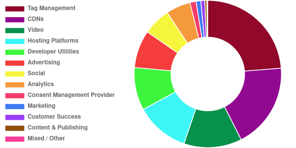

# [Third Party Web](https://www.thirdpartyweb.today/)

## Check out the shiny new web UI https://www.thirdpartyweb.today/

Data on third party entities and their impact on the web.

This document is a summary of which third party scripts are most responsible for excessive JavaScript execution on the web today.

## Table of Contents

1.  [Goals](#goals)
1.  [Methodology](#methodology)
1.  [npm Module](#npm-module)
1.  [Updates](#updates)
1.  [Data](#data)
    1.  [Summary](#summary)
    1.  [How to Interpret](#how-to-interpret)
    1.  [Third Parties by Category](#by-category)
        1.  [Advertising](#ad)
        1.  [Analytics](#analytics)
        1.  [Social](#social)
        1.  [Video](#video)
        1.  [Developer Utilities](#utility)
        1.  [Hosting Platforms](#hosting)
        1.  [Marketing](#marketing)
        1.  [Customer Success](#customer-success)
        1.  [Content & Publishing](#content)
        1.  [CDNs](#cdn)
        1.  [Tag Management](#tag-manager)
        1.  [Consent Management Provider](#consent-provider)
        1.  [Mixed / Other](#other)
    1.  [Third Parties by Total Impact](#by-total-impact)
1.  [Future Work](#future-work)
1.  [FAQs](#faqs)
1.  [Contributing](#contributing)

## Goals

1.  Quantify the impact of third party scripts on the web.
1.  Identify the third party scripts on the web that have the greatest performance cost.
1.  Give developers the information they need to make informed decisions about which third parties to include on their sites.
1.  Incentivize responsible third party script behavior.
1.  Make this information accessible and useful.

## Methodology

[HTTP Archive](https://httparchive.org/) is an initiative that tracks how the web is built. Every month, ~4 million sites are crawled with [Lighthouse](https://github.com/GoogleChrome/lighthouse) on mobile. Lighthouse breaks down the total script execution time of each page and attributes the execution to a URL. Using [BigQuery](https://cloud.google.com/bigquery/), this project aggregates the script execution to the origin-level and assigns each origin to the responsible entity.

## npm Module

The entity classification data is available as an npm module.

```js
const {getEntity} = require('third-party-web')
const entity = getEntity('https://d36mpcpuzc4ztk.cloudfront.net/js/visitor.js')
console.log(entity)
//   {
//     "name": "Freshdesk",
//     "homepage": "https://freshdesk.com/",
//     "category": "customer-success",
//     "domains": ["d36mpcpuzc4ztk.cloudfront.net"]
//   }
```

## Updates

## 2024-07-01 dataset

Some third parties use a dynamic subdomain to serve its main script on websites (e.g .domain.com). Some of these subdomain scripts are saved under observed-domains JSON file as results of the `sql/all-observed-domains-query.sql` query but analyzing http archive database we found a lot that are ignored because of number of occurrences (less than 50 ).

So, we've created a new query to keep observed domains with occurrence below 50 only if its mapped entity (based on entity.js) has a total occurrence (of all its declared domain) greater than 50.

## 2021-01-01 dataset

Due to a change in HTTPArchive measurement which temporarily disabled site-isolation (out-of-process iframes), all of the third-parties whose work previously took place off the main-thread are now counted _on_ the main thread (and thus appear in our stats). This is most evident in the change to Google-owned properties such as YouTube and Doubleclick whose _complete_ cost are now captured.

## 2019-05-13 dataset

A shortcoming of the attribution approach has been fixed. Total usage is now reported based on the number of _pages_ in the dataset that use the third-party, not the number of _scripts_. Correspondingly, all average impact times are now reported _per page_ rather than _per script_. Previously, a third party could appear to have a lower impact or be more popular simply by splitting their work across multiple files.

Third-parties that performed most of their work from a single script should see little to no impact from this change, but some entities have seen significant ranking movement. Hosting providers that host entire pages are, understandably, the most affected.

Some notable changes below:

| Third-Party | Previously (per-script) | Now (per-page) |
| ----------- | ----------------------- | -------------- |
| Beeketing   | 137 ms                  | 465 ms         |
| Sumo        | 263 ms                  | 798 ms         |
| Tumblr      | 324 ms                  | 1499 ms        |
| Yandex APIs | 393 ms                  | 1231 ms        |
| Google Ads  | 402 ms                  | 1285 ms        |
| Wix         | 972 ms                  | 5393 ms        |

## 2019-05-06 dataset

Google Ads clarified that `www.googletagservices.com` serves more ad scripts than generic tag management, and it has been reclassified accordingly. This has dropped the overall Tag Management share considerably back down to its earlier position.

## 2019-03-01 dataset

Almost 2,000 entities tracked now across ~3,000+ domains! Huge props to [@simonhearne](https://twitter.com/simonhearne) for making this massive increase possible. Tag Managers have now been split out into their own category since they represented such a large percentage of the "Mixed / Other" category.

## 2019-02-01 dataset

Huge props to [WordAds](https://wordads.co/) for reducing their impact from ~2.5s to ~200ms on average! A few entities are showing considerably less data this cycle (Media Math, Crazy Egg, DoubleVerify, Bootstrap CDN). Perhaps they've added new CDNs/hostnames that we haven't identified or the basket of sites in HTTPArchive has shifted away from their usage.

## Data

### Summary

Across top ~4 million sites, ~2700 origins account for ~57% of all script execution time with the top 50 entities already accounting for ~47%. Third party script execution is the majority chunk of the web today, and it's important to make informed choices.

### How to Interpret

Each entity has a number of data points available.

1.  **Usage (Total Number of Occurrences)** - how many scripts from their origins were included on pages
1.  **Total Impact (Total Execution Time)** - how many seconds were spent executing their scripts across the web
1.  **Average Impact (Average Execution Time)** - on average, how many milliseconds were spent executing each script
1.  **Category** - what type of script is this

<a name="by-category"></a>

### Third Parties by Category

This section breaks down third parties by category. The third parties in each category are ranked from first to last based on the average impact of their scripts. Perhaps the most important comparisons lie here. You always need to pick an analytics provider, but at least you can pick the most well-behaved analytics provider.

#### Overall Breakdown

Unsurprisingly, ads account for the largest identifiable chunk of third party script execution.



<a name="ad"></a>

#### Advertising

These scripts are part of advertising networks, either serving or measuring.

| Rank | Name                                                                             | Usage     | Average Impact |
| ---- | -------------------------------------------------------------------------------- | --------- | -------------- |
| 1    | SPX                                                                              | 12,862    | 4 ms           |
| 2    | TripleLift                                                                       | 4,655     | 9 ms           |
| 3    | GumGum                                                                           | 56,421    | 20 ms          |
| 4    | Adyoulike                                                                        | 44,103    | 26 ms          |
| 5    | adKernel                                                                         | 11,212    | 42 ms          |
| 6    | Constant Contact                                                                 | 30,691    | 126 ms         |
| 7    | [AppNexus](https://www.appnexus.com/)                                            | 130,628   | 159 ms         |
| 8    | TrustX                                                                           | 10,929    | 183 ms         |
| 9    | FreakOut                                                                         | 3,979     | 235 ms         |
| 10   | Simpli.fi                                                                        | 28,264    | 238 ms         |
| 11   | Intercept Interactive                                                            | 4,266     | 240 ms         |
| 12   | ActiveCampaign                                                                   | 35,789    | 251 ms         |
| 13   | [OpenX](https://www.openx.com/)                                                  | 80,473    | 261 ms         |
| 14   | MailMunch                                                                        | 29,193    | 283 ms         |
| 15   | [33 Across](https://33across.com/)                                               | 85,223    | 289 ms         |
| 16   | [The Trade Desk](https://www.thetradedesk.com/)                                  | 71,134    | 295 ms         |
| 17   | Intent IQ                                                                        | 7,371     | 309 ms         |
| 18   | sovrn                                                                            | 44,614    | 315 ms         |
| 19   | [Media.net](https://www.media.net/)                                              | 17,874    | 324 ms         |
| 20   | SiteScout                                                                        | 6,320     | 328 ms         |
| 21   | LINE Corporation                                                                 | 71,448    | 328 ms         |
| 22   | Affiliate Window                                                                 | 15,316    | 332 ms         |
| 23   | RTB House AdPilot                                                                | 26,956    | 351 ms         |
| 24   | [Scorecard Research](https://www.scorecardresearch.com/)                         | 68,674    | 355 ms         |
| 25   | Drip                                                                             | 3,774     | 356 ms         |
| 26   | [Basis](https://basis.net/)                                                      | 6,909     | 372 ms         |
| 27   | [Ozone Project](https://www.ozoneproject.com/)                                   | 8,602     | 383 ms         |
| 28   | [Yahoo!](https://www.yahoo.com/)                                                 | 33,182    | 400 ms         |
| 29   | DTSCOUT                                                                          | 8,952     | 411 ms         |
| 30   | Adform                                                                           | 23,387    | 418 ms         |
| 31   | [Bing Ads](https://bingads.microsoft.com)                                        | 395,694   | 421 ms         |
| 32   | StackAdapt                                                                       | 38,414    | 479 ms         |
| 33   | TVSquared                                                                        | 7,831     | 482 ms         |
| 34   | [F@N Communications](https://www.fancs.com/)                                     | 9,033     | 484 ms         |
| 35   | Twitter Online Conversion Tracking                                               | 128,082   | 529 ms         |
| 36   | Crowd Control                                                                    | 121,604   | 534 ms         |
| 37   | LinkedIn Ads                                                                     | 378,388   | 608 ms         |
| 38   | AdsWizz                                                                          | 3,262     | 618 ms         |
| 39   | Index Exchange                                                                   | 17,669    | 630 ms         |
| 40   | Rocket Fuel                                                                      | 3,922     | 643 ms         |
| 41   | [Yahoo! JAPAN Ads](https://marketing.yahoo.co.jp/service/yahooads/)              | 81,685    | 655 ms         |
| 42   | Smart AdServer                                                                   | 106,809   | 660 ms         |
| 43   | Rakuten Marketing                                                                | 5,745     | 664 ms         |
| 44   | Simplicity Marketing                                                             | 5,801     | 669 ms         |
| 45   | Gemius                                                                           | 29,291    | 684 ms         |
| 46   | Impact Radius                                                                    | 9,358     | 698 ms         |
| 47   | BlueCava                                                                         | 8,325     | 699 ms         |
| 48   | JuicyAds                                                                         | 4,413     | 752 ms         |
| 49   | i-mobile                                                                         | 32,952    | 778 ms         |
| 50   | [Criteo](https://www.criteo.com/)                                                | 265,702   | 781 ms         |
| 51   | AdMatic                                                                          | 6,115     | 811 ms         |
| 52   | Geniee                                                                           | 14,898    | 817 ms         |
| 53   | [Outbrain](https://www.outbrain.com/)                                            | 20,201    | 841 ms         |
| 54   | Technorati                                                                       | 3,734     | 892 ms         |
| 55   | Customer.io                                                                      | 3,232     | 916 ms         |
| 56   | Onfocus                                                                          | 80,982    | 923 ms         |
| 57   | AudienceSearch                                                                   | 88,693    | 959 ms         |
| 58   | Teads                                                                            | 11,379    | 1080 ms        |
| 59   | IPONWEB                                                                          | 45,262    | 1102 ms        |
| 60   | AdRiver                                                                          | 11,169    | 1144 ms        |
| 61   | Tynt                                                                             | 78,171    | 1156 ms        |
| 62   | [LiveRamp Privacy Manager](https://liveramp.com/privacy-legal-compliance/)       | 21,493    | 1177 ms        |
| 63   | Unbounce                                                                         | 10,273    | 1189 ms        |
| 64   | [Hybrid](https://hybrid.ai/)                                                     | 5,778     | 1190 ms        |
| 65   | Auto Link Maker                                                                  | 4,528     | 1208 ms        |
| 66   | [Supership](https://supership.jp/)                                               | 30,498    | 1400 ms        |
| 67   | Salesforce.com                                                                   | 4,998     | 1557 ms        |
| 68   | [Seedtag](https://www.seedtag.com/)                                              | 100,869   | 1572 ms        |
| 69   | Skimbit                                                                          | 6,458     | 1611 ms        |
| 70   | LoopMe                                                                           | 4,613     | 1630 ms        |
| 71   | [Adroll](https://www.adroll.com/)                                                | 50,330    | 1675 ms        |
| 72   | [ID5 Identity Cloud](https://id5.io/)                                            | 184,884   | 2063 ms        |
| 73   | VigLink                                                                          | 6,673     | 2198 ms        |
| 74   | InMobi                                                                           | 63,304    | 2199 ms        |
| 75   | Cxense                                                                           | 6,077     | 2201 ms        |
| 76   | fluct                                                                            | 16,293    | 2280 ms        |
| 77   | [Attentive](https://attentivemobile.com/)                                        | 13,511    | 2565 ms        |
| 78   | [Amazon Ads](https://ad.amazon.com/)                                             | 211,731   | 3008 ms        |
| 79   | LoyaltyLion                                                                      | 6,907     | 3095 ms        |
| 80   | LongTail Ad Solutions                                                            | 9,004     | 3524 ms        |
| 81   | TrafficStars                                                                     | 16,071    | 3540 ms        |
| 82   | Klaviyo                                                                          | 380,102   | 3635 ms        |
| 83   | Connatix                                                                         | 9,952     | 4337 ms        |
| 84   | [Taboola](https://www.taboola.com/)                                              | 71,564    | 4400 ms        |
| 85   | [Yandex Ads](https://yandex.com/adv/)                                            | 12,524    | 4605 ms        |
| 86   | Conversion Labs                                                                  | 3,343     | 4885 ms        |
| 87   | Microad                                                                          | 42,352    | 5017 ms        |
| 88   | OptiMonk                                                                         | 20,983    | 5236 ms        |
| 89   | [Rubicon Project](https://rubiconproject.com/)                                   | 199,489   | 5955 ms        |
| 90   | Privy                                                                            | 27,953    | 6410 ms        |
| 91   | [Pubmatic](https://pubmatic.com/)                                                | 201,510   | 6594 ms        |
| 92   | Infolinks                                                                        | 7,665     | 6779 ms        |
| 93   | [AdScore](https://www.adscore.com/)                                              | 8,130     | 7057 ms        |
| 94   | [Integral Ad Science](https://integralads.com/uk/)                               | 8,419     | 7105 ms        |
| 95   | [DoubleVerify](https://www.doubleverify.com/)                                    | 4,467     | 7599 ms        |
| 96   | [Google/Doubleclick Ads](https://marketingplatform.google.com/about/enterprise/) | 1,848,353 | 7911 ms        |
| 97   | [Web Content Assessor](https://mediatrust.com/)                                  | 3,276     | 8458 ms        |
| 98   | [MGID](https://www.mgid.com/)                                                    | 18,494    | 9926 ms        |
| 99   | Yahoo! Ad Exchange                                                               | 4,925     | 14032 ms       |
| 100  | [Mediavine](https://www.mediavine.com/)                                          | 13,344    | 27647 ms       |

<a name="analytics"></a>

#### Analytics

These scripts measure or track users and their actions. There's a wide range in impact here depending on what's being tracked.

| Rank | Name                                                                          | Usage     | Average Impact |
| ---- | ----------------------------------------------------------------------------- | --------- | -------------- |
| 1    | [Fathom Analytics](https://usefathom.com/)                                    | 2,282     | 218 ms         |
| 2    | [Mouseflow](https://mouseflow.com/)                                           | 13,857    | 219 ms         |
| 3    | Fastest Forward                                                               | 3,005     | 232 ms         |
| 4    | [SpeedCurve RUM](https://www.speedcurve.com/features/performance-monitoring/) | 11,420    | 245 ms         |
| 5    | [Pingdom RUM](https://www.pingdom.com/product/performance-monitoring/)        | 1,780     | 259 ms         |
| 6    | [Snapchat](https://www.snapchat.com)                                          | 22,266    | 273 ms         |
| 7    | [WordPress Site Stats](https://wp.com/)                                       | 151,949   | 280 ms         |
| 8    | Roxr Software                                                                 | 18,492    | 291 ms         |
| 9    | Woopra                                                                        | 1,842     | 311 ms         |
| 10   | Movable Ink                                                                   | 2,363     | 313 ms         |
| 11   | [Smartlook](https://www.smartlook.com/)                                       | 25,231    | 316 ms         |
| 12   | [LiveRamp IdentityLink](https://liveramp.com/discover-identitylink/)          | 1,220     | 334 ms         |
| 13   | [AD EBis](https://www.ebis.ne.jp/)                                            | 2,028     | 340 ms         |
| 14   | [GoSquared](https://www.gosquared.com)                                        | 1,049     | 343 ms         |
| 15   | [Quantcast](https://www.quantcast.com)                                        | 72,212    | 390 ms         |
| 16   | Ezoic                                                                         | 5,265     | 398 ms         |
| 17   | Exponea                                                                       | 2,315     | 401 ms         |
| 18   | Polldaddy                                                                     | 1,966     | 409 ms         |
| 19   | [Braze](https://www.braze.com)                                                | 14,977    | 414 ms         |
| 20   | [mPulse](https://developer.akamai.com/akamai-mpulse)                          | 46,266    | 473 ms         |
| 21   | Stamped.io                                                                    | 20,325    | 474 ms         |
| 22   | [XiTi](https://www.atinternet.com/en/)                                        | 21,195    | 505 ms         |
| 23   | [Usabilla](https://usabilla.com)                                              | 2,446     | 517 ms         |
| 24   | Treasure Data                                                                 | 24,471    | 532 ms         |
| 25   | Site24x7 Real User Monitoring                                                 | 1,316     | 536 ms         |
| 26   | [DotMetrics](https://www.dotmetrics.net/)                                     | 2,018     | 545 ms         |
| 27   | [Google Analytics](https://marketingplatform.google.com/about/analytics/)     | 4,784,046 | 548 ms         |
| 28   | IBM Acoustic Campaign                                                         | 1,021     | 559 ms         |
| 29   | Sailthru                                                                      | 2,329     | 563 ms         |
| 30   | Conversant                                                                    | 32,757    | 573 ms         |
| 31   | [Snowplow](https://snowplowanalytics.com/)                                    | 135,893   | 575 ms         |
| 32   | WebInsight                                                                    | 2,831     | 699 ms         |
| 33   | StatCounter                                                                   | 80,356    | 722 ms         |
| 34   | Marchex                                                                       | 2,602     | 751 ms         |
| 35   | CleverTap                                                                     | 2,320     | 751 ms         |
| 36   | [Brandmetrics](https://www.brandmetrics.com)                                  | 26,015    | 788 ms         |
| 37   | Smart Insight Tracking                                                        | 3,571     | 792 ms         |
| 38   | Okta                                                                          | 4,729     | 909 ms         |
| 39   | [Matomo](https://matomo.org/)                                                 | 27,930    | 929 ms         |
| 40   | Parse.ly                                                                      | 7,501     | 950 ms         |
| 41   | Heap                                                                          | 15,290    | 1053 ms        |
| 42   | [Baidu Analytics](https://tongji.baidu.com/web/welcome/login)                 | 43,598    | 1098 ms        |
| 43   | Chartbeat                                                                     | 9,130     | 1149 ms        |
| 44   | Trust Pilot                                                                   | 74,463    | 1153 ms        |
| 45   | CallRail                                                                      | 61,715    | 1169 ms        |
| 46   | CallTrackingMetrics                                                           | 16,363    | 1188 ms        |
| 47   | Net Reviews                                                                   | 1,885     | 1268 ms        |
| 48   | SurveyMonkey                                                                  | 2,377     | 1298 ms        |
| 49   | [Marketo](https://www.marketo.com)                                            | 3,704     | 1309 ms        |
| 50   | Monetate                                                                      | 2,328     | 1360 ms        |
| 51   | etracker                                                                      | 10,024    | 1446 ms        |
| 52   | [Mixpanel](https://mixpanel.com/)                                             | 37,315    | 1466 ms        |
| 53   | [Google Optimize](https://marketingplatform.google.com/about/optimize/)       | 47,133    | 1502 ms        |
| 54   | [Lucky Orange](https://www.luckyorange.com/)                                  | 49,311    | 1544 ms        |
| 55   | Trialfire                                                                     | 2,502     | 1591 ms        |
| 56   | Nosto                                                                         | 1,930     | 1628 ms        |
| 57   | [Segment](https://segment.com/)                                               | 44,365    | 1668 ms        |
| 58   | Amplitude Mobile Analytics                                                    | 54,848    | 1679 ms        |
| 59   | [Nielsen NetRatings SiteCensus](http://www.nielsen-online.com/intlpage.html)  | 7,533     | 1679 ms        |
| 60   | [PageSense](https://www.zoho.com/pagesense/)                                  | 16,243    | 1782 ms        |
| 61   | Evergage                                                                      | 5,480     | 1842 ms        |
| 62   | [Pendo](https://www.pendo.io)                                                 | 28,503    | 1861 ms        |
| 63   | [BowNow](https://bow-now.jp/)                                                 | 4,801     | 1918 ms        |
| 64   | Reviews.io                                                                    | 7,941     | 2019 ms        |
| 65   | Inspectlet                                                                    | 6,884     | 2045 ms        |
| 66   | Feefo.com                                                                     | 3,358     | 2189 ms        |
| 67   | [VWO](https://vwo.com)                                                        | 10,747    | 2248 ms        |
| 68   | UpSellit                                                                      | 2,966     | 2250 ms        |
| 69   | [Appcues](https://www.appcues.com/)                                           | 5,003     | 2303 ms        |
| 70   | [AB Tasty](https://www.abtasty.com/)                                          | 6,154     | 2450 ms        |
| 71   | Clerk.io ApS                                                                  | 3,520     | 2503 ms        |
| 72   | Bazaarvoice                                                                   | 7,995     | 2599 ms        |
| 73   | Reviews.co.uk                                                                 | 2,568     | 2663 ms        |
| 74   | Qualtrics                                                                     | 13,985    | 2709 ms        |
| 75   | Evidon                                                                        | 1,416     | 2967 ms        |
| 76   | [Hotjar](https://www.hotjar.com/)                                             | 487,045   | 3005 ms        |
| 77   | FullStory                                                                     | 21,556    | 3433 ms        |
| 78   | PowerReviews                                                                  | 2,193     | 3658 ms        |
| 79   | [Crazy Egg](https://www.crazyegg.com/)                                        | 55,610    | 3897 ms        |
| 80   | [Optimizely](https://www.optimizely.com/)                                     | 23,202    | 3943 ms        |
| 81   | Insider                                                                       | 4,084     | 4190 ms        |
| 82   | [Kameleoon](https://www.kameleoon.com/)                                       | 3,627     | 4886 ms        |
| 83   | Gigya                                                                         | 3,519     | 5610 ms        |
| 84   | Convert Insights                                                              | 8,210     | 5800 ms        |
| 85   | ContentSquare                                                                 | 40,918    | 6027 ms        |
| 86   | Dynatrace                                                                     | 2,845     | 6543 ms        |
| 87   | Decibel Insight                                                               | 1,298     | 6733 ms        |
| 88   | [Quantum Metric](https://www.quantummetric.com/)                              | 2,450     | 7928 ms        |
| 89   | TrackJS                                                                       | 3,005     | 8605 ms        |
| 90   | [Yandex Metrica](https://metrica.yandex.com/about?)                           | 990,622   | 9308 ms        |

<a name="social"></a>

#### Social

These scripts enable social features.

| Rank | Name                                        | Usage     | Average Impact |
| ---- | ------------------------------------------- | --------- | -------------- |
| 1    | [Shareaholic](https://www.shareaholic.com/) | 1,657     | 382 ms         |
| 2    | [AddToAny](https://www.addtoany.com/)       | 145,943   | 546 ms         |
| 3    | [Pinterest](https://pinterest.com/)         | 252,790   | 621 ms         |
| 4    | [LinkedIn](https://www.linkedin.com/)       | 28,530    | 1165 ms        |
| 5    | [ShareThis](https://www.sharethis.com/)     | 135,354   | 1425 ms        |
| 6    | [Twitter](https://twitter.com)              | 449,477   | 2116 ms        |
| 7    | [Facebook](https://www.facebook.com)        | 5,573,133 | 2324 ms        |
| 8    | [TikTok](https://www.tiktok.com/en/)        | 430,917   | 2570 ms        |
| 9    | reddit                                      | 66,629    | 2699 ms        |
| 10   | Kakao                                       | 84,808    | 3204 ms        |
| 11   | SocialShopWave                              | 1,305     | 4049 ms        |
| 12   | [Instagram](https://www.instagram.com)      | 37,449    | 6664 ms        |
| 13   | [Tumblr](https://tumblr.com/)               | 25,390    | 9903 ms        |
| 14   | [Disqus](https://disqus.com/)               | 14,070    | 11335 ms       |
| 15   | [PIXNET](https://www.pixnet.net/)           | 7,780     | 14940 ms       |
| 16   | [VK](https://vk.com/)                       | 25,815    | 15565 ms       |
| 17   | LiveJournal                                 | 14,501    | 20003 ms       |

<a name="video"></a>

#### Video

These scripts enable video player and streaming functionality.

| Rank | Name                                         | Usage     | Average Impact |
| ---- | -------------------------------------------- | --------- | -------------- |
| 1    | [Brightcove](https://www.brightcove.com/en/) | 26,136    | 4129 ms        |
| 2    | [Vimeo](https://vimeo.com/)                  | 169,842   | 18859 ms       |
| 3    | [Wistia](https://wistia.com/)                | 34,895    | 20228 ms       |
| 4    | [YouTube](https://youtube.com)               | 1,255,206 | 25964 ms       |
| 5    | [Twitch](https://twitch.tv/)                 | 1,558     | 79731 ms       |

<a name="utility"></a>

#### Developer Utilities

These scripts are developer utilities (API clients, site monitoring, fraud detection, etc).

| Rank | Name                                                                      | Usage     | Average Impact |
| ---- | ------------------------------------------------------------------------- | --------- | -------------- |
| 1    | [Statuspage](https://www.statuspage.io)                                   | 2,723     | 110 ms         |
| 2    | [Cloudflare](https://www.cloudflare.com/website-optimization/)            | 3,266,653 | 275 ms         |
| 3    | Webmarked                                                                 | 2,295     | 282 ms         |
| 4    | [Pusher](https://pusher.com/)                                             | 3,221     | 301 ms         |
| 5    | Cludo                                                                     | 2,221     | 398 ms         |
| 6    | MathJax                                                                   | 1,209     | 450 ms         |
| 7    | Macropod BugHerd                                                          | 8,473     | 451 ms         |
| 8    | Raygun                                                                    | 4,038     | 495 ms         |
| 9    | Rollbar                                                                   | 6,033     | 547 ms         |
| 10   | PrintFriendly                                                             | 1,045     | 560 ms         |
| 11   | Webkul                                                                    | 1,667     | 584 ms         |
| 12   | [Afterpay](https://www.afterpay.com/)                                     | 14,578    | 600 ms         |
| 13   | Hexton                                                                    | 49,918    | 634 ms         |
| 14   | [Doofinder](https://www.doofinder.com/)                                   | 24,175    | 649 ms         |
| 15   | [Ipify](https://www.ipify.org)                                            | 4,224     | 675 ms         |
| 16   | Braintree Payments                                                        | 2,726     | 685 ms         |
| 17   | [OneSignal](https://onesignal.com/)                                       | 102,367   | 740 ms         |
| 18   | [Foxentry](https://foxentry.cz/)                                          | 4,578     | 774 ms         |
| 19   | CyberSource (Visa)                                                        | 2,963     | 788 ms         |
| 20   | [Amazon Pay](https://pay.amazon.com)                                      | 14,846    | 789 ms         |
| 21   | LightWidget                                                               | 10,404    | 791 ms         |
| 22   | [mParticle](https://www.mparticle.com/)                                   | 1,768     | 813 ms         |
| 23   | [Sentry](https://sentry.io/)                                              | 403,322   | 896 ms         |
| 24   | Seznam                                                                    | 8,864     | 986 ms         |
| 25   | Riskified                                                                 | 3,711     | 1020 ms        |
| 26   | [Auth0](https://auth0.com/)                                               | 1,535     | 1037 ms        |
| 27   | [Netlify](https://www.netlify.com/)                                       | 1,719     | 1040 ms        |
| 28   | [G2](https://www.g2.com/)                                                 | 1,264     | 1059 ms        |
| 29   | iovation                                                                  | 3,364     | 1219 ms        |
| 30   | Wufoo                                                                     | 4,166     | 1322 ms        |
| 31   | [New Relic](https://newrelic.com/)                                        | 276,329   | 1353 ms        |
| 32   | Google reCAPTCHA                                                          | 78,742    | 1361 ms        |
| 33   | [Other Google APIs/SDKs](https://developers.google.com/apis-explorer/#p/) | 5,021,577 | 1366 ms        |
| 34   | Key CDN                                                                   | 20,860    | 1421 ms        |
| 35   | [Yandex APIs](https://yandex.ru/)                                         | 78,477    | 1422 ms        |
| 36   | Highcharts                                                                | 4,854     | 1444 ms        |
| 37   | Bugsnag                                                                   | 43,841    | 1465 ms        |
| 38   | Swiftype                                                                  | 1,169     | 1502 ms        |
| 39   | Cookie-Script.com                                                         | 124,714   | 1520 ms        |
| 40   | [TrustArc](https://www.trustarc.com/)                                     | 11,183    | 1577 ms        |
| 41   | [Cookiebot](https://www.cookiebot.com/)                                   | 361,908   | 1711 ms        |
| 42   | [Clarity](https://clarity.microsoft.com/)                                 | 1,237,472 | 1722 ms        |
| 43   | Trusted Shops                                                             | 32,496    | 1760 ms        |
| 44   | GitHub                                                                    | 27,276    | 1957 ms        |
| 45   | Cookie Reports                                                            | 1,372     | 2010 ms        |
| 46   | GetSiteControl                                                            | 5,101     | 2206 ms        |
| 47   | FoxyCart                                                                  | 1,161     | 2210 ms        |
| 48   | Klarna                                                                    | 20,028    | 2348 ms        |
| 49   | Bold Commerce                                                             | 11,503    | 2484 ms        |
| 50   | [Accessibe Accessibility Overlay](https://accessibe.com/)                 | 4,169     | 2676 ms        |
| 51   | Mapbox                                                                    | 31,544    | 3215 ms        |
| 52   | [AppDynamics](https://www.appdynamics.com/)                               | 2,360     | 3417 ms        |
| 53   | Affirm                                                                    | 13,375    | 3556 ms        |
| 54   | Klevu Search                                                              | 2,156     | 3587 ms        |
| 55   | [Vidyard](https://www.vidyard.com/)                                       | 1,826     | 3644 ms        |
| 56   | [Google Maps](https://www.google.com/maps)                                | 1,935,905 | 3675 ms        |
| 57   | ThreatMetrix                                                              | 8,720     | 3853 ms        |
| 58   | Secomapp                                                                  | 2,833     | 4047 ms        |
| 59   | Marker                                                                    | 4,425     | 4112 ms        |
| 60   | MaxMind                                                                   | 1,281     | 4133 ms        |
| 61   | iubenda                                                                   | 200,138   | 4233 ms        |
| 62   | [PayPal](https://paypal.com)                                              | 142,714   | 4572 ms        |
| 63   | [Checkout.com](https://www.checkout.com)                                  | 7,089     | 4621 ms        |
| 64   | WisePops                                                                  | 2,263     | 4886 ms        |
| 65   | Rambler                                                                   | 21,933    | 4901 ms        |
| 66   | Forter                                                                    | 10,294    | 5053 ms        |
| 67   | Adyen                                                                     | 5,311     | 6412 ms        |
| 68   | [GoDaddy](https://www.godaddy.com/)                                       | 239,276   | 6718 ms        |
| 69   | Fastly                                                                    | 1,967     | 6733 ms        |
| 70   | [Stripe](https://stripe.com)                                              | 368,729   | 7322 ms        |
| 71   | [Noibu](https://www.noibu.com)                                            | 1,164     | 7516 ms        |
| 72   | Datacamp                                                                  | 2,366     | 11934 ms       |
| 73   | Signyfyd                                                                  | 4,991     | 16426 ms       |
| 74   | [POWr](https://www.powr.io)                                               | 57,993    | 18753 ms       |
| 75   | Esri ArcGIS                                                               | 6,876     | 29736 ms       |

<a name="hosting"></a>

#### Hosting Platforms

These scripts are from web hosting platforms (WordPress, Wix, Squarespace, etc). Note that in this category, this can sometimes be the entirety of script on the page, and so the "impact" rank might be misleading. In the case of WordPress, this just indicates the libraries hosted and served _by_ WordPress not all sites using self-hosted WordPress.

| Rank | Name                                                                                      | Usage   | Average Impact |
| ---- | ----------------------------------------------------------------------------------------- | ------- | -------------- |
| 1    | Silktide                                                                                  | 1,791   | 369 ms         |
| 2    | Ecwid                                                                                     | 12,372  | 1081 ms        |
| 3    | Civic                                                                                     | 14,152  | 2082 ms        |
| 4    | Global-e                                                                                  | 3,070   | 2200 ms        |
| 5    | [WordPress](https://wp.com/)                                                              | 391,390 | 2251 ms        |
| 6    | [Dealer](https://www.dealer.com/)                                                         | 4,362   | 2615 ms        |
| 7    | [Blogger](https://www.blogger.com/)                                                       | 291,237 | 3115 ms        |
| 8    | [Salesforce Commerce Cloud](https://www.salesforce.com/products/commerce-cloud/overview/) | 6,989   | 3176 ms        |
| 9    | Rackspace                                                                                 | 3,936   | 3426 ms        |
| 10   | [Shopify](https://www.shopify.com/)                                                       | 911,960 | 4794 ms        |
| 11   | [Tilda](https://tilda.cc/)                                                                | 130,332 | 5024 ms        |
| 12   | Yottaa                                                                                    | 1,175   | 5337 ms        |
| 13   | [Hatena Blog](https://hatenablog.com/)                                                    | 75,784  | 9127 ms        |
| 14   | [WebsiteBuilder.com](https://www.websitebuilder.com)                                      | 6,419   | 12181 ms       |
| 15   | [Wix](https://www.wix.com/)                                                               | 825,146 | 16162 ms       |
| 16   | [Squarespace](https://www.squarespace.com/)                                               | 478,879 | 18005 ms       |
| 17   | [Framer CDN](https://www.framer.com)                                                      | 39,564  | 22993 ms       |
| 18   | [Weebly](https://www.weebly.com/)                                                         | 113,537 | 28799 ms       |

<a name="marketing"></a>

#### Marketing

These scripts are from marketing tools that add popups/newsletters/etc.

| Rank | Name                                        | Usage   | Average Impact |
| ---- | ------------------------------------------- | ------- | -------------- |
| 1    | [SalesLoft](https://salesloft.com/)         | 1,681   | 238 ms         |
| 2    | [Albacross](https://albacross.com/)         | 3,888   | 279 ms         |
| 3    | [Podsights](https://podsights.com/)         | 1,418   | 315 ms         |
| 4    | Pardot                                      | 1,473   | 421 ms         |
| 5    | DemandBase                                  | 7,181   | 430 ms         |
| 6    | [Convertful](https://convertful.com/)       | 1,843   | 441 ms         |
| 7    | SharpSpring                                 | 4,085   | 816 ms         |
| 8    | [RD Station](https://www.rdstation.com/en/) | 33,491  | 1533 ms        |
| 9    | Wishpond Technologies                       | 2,635   | 1581 ms        |
| 10   | [Hello Bar](https://www.hellobar.com/)      | 5,381   | 1807 ms        |
| 11   | Sojern                                      | 7,885   | 1913 ms        |
| 12   | [Listrak](https://www.listrak.com/)         | 1,598   | 2007 ms        |
| 13   | [OptinMonster](https://optinmonster.com/)   | 2,580   | 2042 ms        |
| 14   | [iZooto](https://www.izooto.com)            | 2,934   | 2503 ms        |
| 15   | [Judge.me](https://judge.me/)               | 13,821  | 2505 ms        |
| 16   | [Mailchimp](https://mailchimp.com/)         | 75,067  | 2566 ms        |
| 17   | [Yotpo](https://www.yotpo.com/)             | 47,418  | 2685 ms        |
| 18   | [PureCars](https://www.purecars.com/)       | 1,025   | 3690 ms        |
| 19   | [Beeketing](https://beeketing.com/)         | 2,169   | 4627 ms        |
| 20   | [Hubspot](https://hubspot.com/)             | 310,544 | 4891 ms        |
| 21   | [KARTE](https://karte.io/)                  | 3,037   | 5339 ms        |
| 22   | [Sumo](https://sumo.com/)                   | 13,294  | 5497 ms        |
| 23   | Bigcommerce                                 | 34,268  | 7214 ms        |
| 24   | [Wunderkind](https://www.wunderkind.co/)    | 2,642   | 7262 ms        |
| 25   | Kargo                                       | 3,855   | 16750 ms       |
| 26   | [Drift](https://www.drift.com/)             | 4,093   | 18457 ms       |
| 27   | [Tray Commerce](https://www.tray.com.br/)   | 24,930  | 19523 ms       |

<a name="customer-success"></a>

#### Customer Success

These scripts are from customer support/marketing providers that offer chat and contact solutions. These scripts are generally heavier in weight.

| Rank | Name                                                        | Usage   | Average Impact |
| ---- | ----------------------------------------------------------- | ------- | -------------- |
| 1    | [Crisp](https://crisp.chat/)                                | 1,450   | 131 ms         |
| 2    | Provide Support                                             | 1,726   | 297 ms         |
| 3    | [Chatwoot](https://www.chatwoot.com/)                       | 1,081   | 580 ms         |
| 4    | SnapEngage                                                  | 1,360   | 614 ms         |
| 5    | iPerceptions                                                | 8,399   | 806 ms         |
| 6    | LiveTex                                                     | 2,599   | 1135 ms        |
| 7    | Pure Chat                                                   | 3,582   | 1314 ms        |
| 8    | WebEngage                                                   | 2,905   | 1438 ms        |
| 9    | LiveHelpNow                                                 | 1,351   | 1622 ms        |
| 10   | [Help Scout](https://www.helpscout.net/)                    | 8,918   | 1685 ms        |
| 11   | iAdvize SAS                                                 | 1,658   | 1737 ms        |
| 12   | [Tawk.to](https://www.tawk.to/)                             | 171,356 | 1806 ms        |
| 13   | [Usersnap](https://usersnap.com)                            | 2,804   | 2001 ms        |
| 14   | Comm100                                                     | 1,221   | 2198 ms        |
| 15   | [Gladly](https://www.gladly.com/)                           | 1,074   | 2440 ms        |
| 16   | [Smartsupp](https://www.smartsupp.com)                      | 33,692  | 2612 ms        |
| 17   | [LivePerson](https://www.liveperson.com/)                   | 3,114   | 3170 ms        |
| 18   | [Ada](https://www.ada.support/)                             | 1,775   | 3703 ms        |
| 19   | [Jivochat](https://www.jivochat.com/)                       | 83,164  | 3938 ms        |
| 20   | [LiveChat](https://www.livechat.com/)                       | 59,444  | 4320 ms        |
| 21   | [Intercom](https://www.intercom.com)                        | 57,804  | 5950 ms        |
| 22   | [Olark](https://www.olark.com/)                             | 8,166   | 6257 ms        |
| 23   | [ZenDesk](https://zendesk.com/)                             | 107,430 | 7951 ms        |
| 24   | Dynamic Yield                                               | 2,376   | 8101 ms        |
| 25   | [Freshchat](https://www.freshworks.com/live-chat-software/) | 11,954  | 12467 ms       |

<a name="content"></a>

#### Content & Publishing

These scripts are from content providers or publishing-specific affiliate tracking.

| Rank | Name                                      | Usage   | Average Impact |
| ---- | ----------------------------------------- | ------- | -------------- |
| 1    | [Spotify](https://www.spotify.com/)       | 16,645  | 32 ms          |
| 2    | freewheel.tv                              | 1,281   | 154 ms         |
| 3    | Indeed                                    | 4,599   | 753 ms         |
| 4    | Accuweather                               | 1,550   | 785 ms         |
| 5    | Flowplayer                                | 1,316   | 966 ms         |
| 6    | Tencent                                   | 13,661  | 1095 ms        |
| 7    | Embedly                                   | 17,245  | 1670 ms        |
| 8    | Cloudinary                                | 3,206   | 1834 ms        |
| 9    | Freetobook                                | 1,013   | 1840 ms        |
| 10   | TripAdvisor                               | 2,558   | 2240 ms        |
| 11   | [AMP](https://amp.dev/)                   | 112,447 | 3850 ms        |
| 12   | CPEx                                      | 1,591   | 5197 ms        |
| 13   | Revcontent                                | 4,602   | 5564 ms        |
| 14   | Booking.com                               | 1,479   | 5987 ms        |
| 15   | OpenTable                                 | 9,762   | 6232 ms        |
| 16   | [Hotmart](https://www.hotmart.com/)       | 2,914   | 6351 ms        |
| 17   | Kaltura Video Platform                    | 1,291   | 13074 ms       |
| 18   | issuu                                     | 3,431   | 13770 ms       |
| 19   | [SoundCloud](https://www.soundcloud.com/) | 7,040   | 14268 ms       |
| 20   | Dailymotion                               | 3,575   | 18698 ms       |
| 21   | Medium                                    | 11,280  | 35002 ms       |

<a name="cdn"></a>

#### CDNs

These are a mixture of publicly hosted open source libraries (e.g. jQuery) served over different public CDNs and private CDN usage. This category is unique in that the origin may have no responsibility for the performance of what's being served. Note that rank here does not imply one CDN is better than the other. It simply indicates that the scripts being served from that origin are lighter/heavier than the ones served by another.

| Rank | Name                                                         | Usage     | Average Impact |
| ---- | ------------------------------------------------------------ | --------- | -------------- |
| 1    | [Google Fonts](https://fonts.google.com/)                    | 299,568   | 7 ms           |
| 2    | [Bootstrap CDN](https://www.bootstrapcdn.com/)               | 70,986    | 186 ms         |
| 3    | Fort Awesome                                                 | 7,043     | 628 ms         |
| 4    | Microsoft Hosted Libs                                        | 35,792    | 687 ms         |
| 5    | [JSPM](https://jspm.org/)                                    | 3,680     | 799 ms         |
| 6    | Monotype                                                     | 3,958     | 920 ms         |
| 7    | [Unpkg](https://unpkg.com)                                   | 2,204     | 988 ms         |
| 8    | [FontAwesome CDN](https://fontawesome.com/)                  | 411,354   | 1145 ms        |
| 9    | [jQuery CDN](https://code.jquery.com/)                       | 1,200,802 | 1226 ms        |
| 10   | [Akamai](https://www.akamai.com/)                            | 14,319    | 1424 ms        |
| 11   | [Cloudflare CDN](https://cdnjs.com/)                         | 1,199,615 | 1547 ms        |
| 12   | [JSDelivr CDN](https://www.jsdelivr.com/)                    | 1,036,460 | 2114 ms        |
| 13   | [Adobe TypeKit](https://fonts.adobe.com/)                    | 204,202   | 2683 ms        |
| 14   | [ESM>CDN](https://esm.sh)                                    | 1,964     | 2741 ms        |
| 15   | Azure Web Services                                           | 56,395    | 3003 ms        |
| 16   | [Google CDN](https://developers.google.com/speed/libraries/) | 5,712,346 | 8111 ms        |
| 17   | [CreateJS CDN](https://code.createjs.com/)                   | 5,083     | 11544 ms       |
| 18   | [Yandex CDN](https://yandex.ru/)                             | 58,637    | 14369 ms       |

<a name="tag-manager"></a>

#### Tag Management

These scripts tend to load lots of other scripts and initiate many tasks.

| Rank | Name                                                                          | Usage      | Average Impact |
| ---- | ----------------------------------------------------------------------------- | ---------- | -------------- |
| 1    | TagCommander                                                                  | 2,639      | 1042 ms        |
| 2    | [Tealium](https://tealium.com/)                                               | 98,327     | 1538 ms        |
| 3    | [Ensighten](https://www.ensighten.com/)                                       | 5,859      | 2403 ms        |
| 4    | [Adobe Tag Manager](https://www.adobe.com/experience-platform/)               | 101,702    | 3246 ms        |
| 5    | [Google Tag Manager](https://marketingplatform.google.com/about/tag-manager/) | 14,696,133 | 4620 ms        |

<a name="consent-provider"></a>

#### Consent Management Provider

IAB Consent Management Providers are the 'Cookie Consent' popups used by many publishers. They're invoked for every page and sit on the critical path between a page loading and adverts being displayed.

| Rank | Name                                                              | Usage   | Average Impact |
| ---- | ----------------------------------------------------------------- | ------- | -------------- |
| 1    | [Trustcommander](https://www.commandersact.com)                   | 3,135   | 908 ms         |
| 2    | [UniConsent CMP](https://www.uniconsent.com)                      | 2,078   | 2259 ms        |
| 3    | [Optanon](https://www.cookielaw.org/)                             | 259,771 | 2370 ms        |
| 4    | [Didomi](https://www.didomi.io/)                                  | 129,993 | 2954 ms        |
| 5    | [Google FundingChoices](https://fundingchoices.google.com/start/) | 632,899 | 3449 ms        |
| 6    | [Usercentrics CMP](https://usercentrics.com)                      | 114,575 | 4230 ms        |
| 7    | [Osano CMP](https://www.osano.com)                                | 34,601  | 6584 ms        |

<a name="other"></a>

#### Mixed / Other

These are miscellaneous scripts delivered via a shared origin with no precise category or attribution. Help us out by identifying more origins!

| Rank | Name                                                                | Usage   | Average Impact |
| ---- | ------------------------------------------------------------------- | ------- | -------------- |
| 1    | ResponsiveVoice                                                     | 11,080  | 446 ms         |
| 2    | [ReadSpeaker](https://www.readspeaker.com)                          | 12,842  | 471 ms         |
| 3    | Loqate                                                              | 1,650   | 692 ms         |
| 4    | [Amazon Web Services](https://aws.amazon.com/s3/)                   | 228,726 | 1066 ms        |
| 5    | [Browsealoud](https://www.texthelp.com/en-gb/products/browsealoud/) | 3,134   | 1790 ms        |
| 6    | Sirv                                                                | 1,756   | 2035 ms        |
| 7    | Heroku                                                              | 16,582  | 3254 ms        |
| 8    | Calendly                                                            | 13,258  | 18501 ms       |

<a name="by-total-impact"></a>

### Third Parties by Total Impact

This section highlights the entities responsible for the most script execution across the web. This helps inform which improvements would have the largest total impact.

| Name                                                                                      | Popularity | Total Impact | Average Impact |
| ----------------------------------------------------------------------------------------- | ---------- | ------------ | -------------- |
| [Google Tag Manager](https://marketingplatform.google.com/about/tag-manager/)             | 14,696,133 | 67,894,585 s | 4620 ms        |
| [Google CDN](https://developers.google.com/speed/libraries/)                              | 5,712,346  | 46,330,050 s | 8111 ms        |
| [YouTube](https://youtube.com)                                                            | 1,255,206  | 32,590,387 s | 25964 ms       |
| [Google/Doubleclick Ads](https://marketingplatform.google.com/about/enterprise/)          | 1,848,353  | 14,622,637 s | 7911 ms        |
| [Wix](https://www.wix.com/)                                                               | 825,146    | 13,335,800 s | 16162 ms       |
| [Facebook](https://www.facebook.com)                                                      | 5,573,133  | 12,954,537 s | 2324 ms        |
| [Yandex Metrica](https://metrica.yandex.com/about?)                                       | 990,622    | 9,220,368 s  | 9308 ms        |
| [Squarespace](https://www.squarespace.com/)                                               | 478,879    | 8,622,269 s  | 18005 ms       |
| [Google Maps](https://www.google.com/maps)                                                | 1,935,905  | 7,113,731 s  | 3675 ms        |
| [Other Google APIs/SDKs](https://developers.google.com/apis-explorer/#p/)                 | 5,021,577  | 6,857,159 s  | 1366 ms        |
| [Shopify](https://www.shopify.com/)                                                       | 911,960    | 4,372,225 s  | 4794 ms        |
| [Weebly](https://www.weebly.com/)                                                         | 113,537    | 3,269,801 s  | 28799 ms       |
| [Vimeo](https://vimeo.com/)                                                               | 169,842    | 3,203,002 s  | 18859 ms       |
| [Stripe](https://stripe.com)                                                              | 368,729    | 2,699,878 s  | 7322 ms        |
| [Google Analytics](https://marketingplatform.google.com/about/analytics/)                 | 4,784,046  | 2,619,347 s  | 548 ms         |
| [JSDelivr CDN](https://www.jsdelivr.com/)                                                 | 1,036,460  | 2,191,477 s  | 2114 ms        |
| [Google FundingChoices](https://fundingchoices.google.com/start/)                         | 632,899    | 2,182,962 s  | 3449 ms        |
| [Clarity](https://clarity.microsoft.com/)                                                 | 1,237,472  | 2,130,682 s  | 1722 ms        |
| [Cloudflare CDN](https://cdnjs.com/)                                                      | 1,199,615  | 1,855,866 s  | 1547 ms        |
| [GoDaddy](https://www.godaddy.com/)                                                       | 239,276    | 1,607,485 s  | 6718 ms        |
| [Hubspot](https://hubspot.com/)                                                           | 310,544    | 1,518,864 s  | 4891 ms        |
| [jQuery CDN](https://code.jquery.com/)                                                    | 1,200,802  | 1,472,387 s  | 1226 ms        |
| [Hotjar](https://www.hotjar.com/)                                                         | 487,045    | 1,463,613 s  | 3005 ms        |
| Klaviyo                                                                                   | 380,102    | 1,381,720 s  | 3635 ms        |
| [Pubmatic](https://pubmatic.com/)                                                         | 201,510    | 1,328,804 s  | 6594 ms        |
| [Rubicon Project](https://rubiconproject.com/)                                            | 199,489    | 1,188,033 s  | 5955 ms        |
| [TikTok](https://www.tiktok.com/en/)                                                      | 430,917    | 1,107,245 s  | 2570 ms        |
| [POWr](https://www.powr.io)                                                               | 57,993     | 1,087,549 s  | 18753 ms       |
| [Twitter](https://twitter.com)                                                            | 449,477    | 950,970 s    | 2116 ms        |
| [Framer CDN](https://www.framer.com)                                                      | 39,564     | 909,695 s    | 22993 ms       |
| [Blogger](https://www.blogger.com/)                                                       | 291,237    | 907,163 s    | 3115 ms        |
| [Cloudflare](https://www.cloudflare.com/website-optimization/)                            | 3,266,653  | 898,397 s    | 275 ms         |
| [WordPress](https://wp.com/)                                                              | 391,390    | 880,981 s    | 2251 ms        |
| [ZenDesk](https://zendesk.com/)                                                           | 107,430    | 854,165 s    | 7951 ms        |
| iubenda                                                                                   | 200,138    | 847,132 s    | 4233 ms        |
| [Yandex CDN](https://yandex.ru/)                                                          | 58,637     | 842,538 s    | 14369 ms       |
| [Wistia](https://wistia.com/)                                                             | 34,895     | 705,858 s    | 20228 ms       |
| [Hatena Blog](https://hatenablog.com/)                                                    | 75,784     | 691,645 s    | 9127 ms        |
| [Tilda](https://tilda.cc/)                                                                | 130,332    | 654,792 s    | 5024 ms        |
| [PayPal](https://paypal.com)                                                              | 142,714    | 652,447 s    | 4572 ms        |
| [Amazon Ads](https://ad.amazon.com/)                                                      | 211,731    | 636,847 s    | 3008 ms        |
| [Cookiebot](https://www.cookiebot.com/)                                                   | 361,908    | 619,377 s    | 1711 ms        |
| [Optanon](https://www.cookielaw.org/)                                                     | 259,771    | 615,617 s    | 2370 ms        |
| [Adobe TypeKit](https://fonts.adobe.com/)                                                 | 204,202    | 547,814 s    | 2683 ms        |
| [Tray Commerce](https://www.tray.com.br/)                                                 | 24,930     | 486,699 s    | 19523 ms       |
| [Usercentrics CMP](https://usercentrics.com)                                              | 114,575    | 484,615 s    | 4230 ms        |
| [FontAwesome CDN](https://fontawesome.com/)                                               | 411,354    | 471,184 s    | 1145 ms        |
| [AMP](https://amp.dev/)                                                                   | 112,447    | 432,974 s    | 3850 ms        |
| [VK](https://vk.com/)                                                                     | 25,815     | 401,819 s    | 15565 ms       |
| Medium                                                                                    | 11,280     | 394,818 s    | 35002 ms       |
| [Didomi](https://www.didomi.io/)                                                          | 129,993    | 384,036 s    | 2954 ms        |
| [ID5 Identity Cloud](https://id5.io/)                                                     | 184,884    | 381,506 s    | 2063 ms        |
| [New Relic](https://newrelic.com/)                                                        | 276,329    | 373,925 s    | 1353 ms        |
| [Mediavine](https://www.mediavine.com/)                                                   | 13,344     | 368,926 s    | 27647 ms       |
| [Sentry](https://sentry.io/)                                                              | 403,322    | 361,258 s    | 896 ms         |
| [Intercom](https://www.intercom.com)                                                      | 57,804     | 343,927 s    | 5950 ms        |
| [Adobe Tag Manager](https://www.adobe.com/experience-platform/)                           | 101,702    | 330,152 s    | 3246 ms        |
| [Jivochat](https://www.jivochat.com/)                                                     | 83,164     | 327,476 s    | 3938 ms        |
| [Taboola](https://www.taboola.com/)                                                       | 71,564     | 314,863 s    | 4400 ms        |
| [Tawk.to](https://www.tawk.to/)                                                           | 171,356    | 309,513 s    | 1806 ms        |
| LiveJournal                                                                               | 14,501     | 290,057 s    | 20003 ms       |
| Kakao                                                                                     | 84,808     | 271,715 s    | 3204 ms        |
| [LiveChat](https://www.livechat.com/)                                                     | 59,444     | 256,821 s    | 4320 ms        |
| [Tumblr](https://tumblr.com/)                                                             | 25,390     | 251,428 s    | 9903 ms        |
| [Instagram](https://www.instagram.com)                                                    | 37,449     | 249,576 s    | 6664 ms        |
| Bigcommerce                                                                               | 34,268     | 247,195 s    | 7214 ms        |
| ContentSquare                                                                             | 40,918     | 246,603 s    | 6027 ms        |
| Calendly                                                                                  | 13,258     | 245,286 s    | 18501 ms       |
| [Amazon Web Services](https://aws.amazon.com/s3/)                                         | 228,726    | 243,807 s    | 1066 ms        |
| LinkedIn Ads                                                                              | 378,388    | 230,244 s    | 608 ms         |
| [Osano CMP](https://www.osano.com)                                                        | 34,601     | 227,817 s    | 6584 ms        |
| [Crazy Egg](https://www.crazyegg.com/)                                                    | 55,610     | 216,689 s    | 3897 ms        |
| Microad                                                                                   | 42,352     | 212,479 s    | 5017 ms        |
| [Criteo](https://www.criteo.com/)                                                         | 265,702    | 207,432 s    | 781 ms         |
| Esri ArcGIS                                                                               | 6,876      | 204,462 s    | 29736 ms       |
| [ShareThis](https://www.sharethis.com/)                                                   | 135,354    | 192,839 s    | 1425 ms        |
| [Mailchimp](https://mailchimp.com/)                                                       | 75,067     | 192,633 s    | 2566 ms        |
| Cookie-Script.com                                                                         | 124,714    | 189,604 s    | 1520 ms        |
| [MGID](https://www.mgid.com/)                                                             | 18,494     | 183,566 s    | 9926 ms        |
| reddit                                                                                    | 66,629     | 179,843 s    | 2699 ms        |
| Privy                                                                                     | 27,953     | 179,175 s    | 6410 ms        |
| Azure Web Services                                                                        | 56,395     | 169,378 s    | 3003 ms        |
| [Bing Ads](https://bingads.microsoft.com)                                                 | 395,694    | 166,444 s    | 421 ms         |
| [Disqus](https://disqus.com/)                                                             | 14,070     | 159,490 s    | 11335 ms       |
| [Seedtag](https://www.seedtag.com/)                                                       | 100,869    | 158,613 s    | 1572 ms        |
| [Pinterest](https://pinterest.com/)                                                       | 252,790    | 156,977 s    | 621 ms         |
| [Tealium](https://tealium.com/)                                                           | 98,327     | 151,272 s    | 1538 ms        |
| [Freshchat](https://www.freshworks.com/live-chat-software/)                               | 11,954     | 149,028 s    | 12467 ms       |
| InMobi                                                                                    | 63,304     | 139,234 s    | 2199 ms        |
| [Yotpo](https://www.yotpo.com/)                                                           | 47,418     | 127,295 s    | 2685 ms        |
| [Twitch](https://twitch.tv/)                                                              | 1,558      | 124,220 s    | 79731 ms       |
| [PIXNET](https://www.pixnet.net/)                                                         | 7,780      | 116,235 s    | 14940 ms       |
| [Yandex APIs](https://yandex.ru/)                                                         | 78,477     | 111,610 s    | 1422 ms        |
| OptiMonk                                                                                  | 20,983     | 109,876 s    | 5236 ms        |
| [Brightcove](https://www.brightcove.com/en/)                                              | 26,136     | 107,907 s    | 4129 ms        |
| Rambler                                                                                   | 21,933     | 107,495 s    | 4901 ms        |
| Google reCAPTCHA                                                                          | 78,742     | 107,194 s    | 1361 ms        |
| Mapbox                                                                                    | 31,544     | 101,426 s    | 3215 ms        |
| [SoundCloud](https://www.soundcloud.com/)                                                 | 7,040      | 100,446 s    | 14268 ms       |
| Amplitude Mobile Analytics                                                                | 54,848     | 92,094 s     | 1679 ms        |
| [Optimizely](https://www.optimizely.com/)                                                 | 23,202     | 91,481 s     | 3943 ms        |
| Tynt                                                                                      | 78,171     | 90,381 s     | 1156 ms        |
| [Smartsupp](https://www.smartsupp.com)                                                    | 33,692     | 87,999 s     | 2612 ms        |
| Trust Pilot                                                                               | 74,463     | 85,870 s     | 1153 ms        |
| AudienceSearch                                                                            | 88,693     | 85,070 s     | 959 ms         |
| [Adroll](https://www.adroll.com/)                                                         | 50,330     | 84,326 s     | 1675 ms        |
| Signyfyd                                                                                  | 4,991      | 81,983 s     | 16426 ms       |
| [AddToAny](https://www.addtoany.com/)                                                     | 145,943    | 79,749 s     | 546 ms         |
| [WebsiteBuilder.com](https://www.websitebuilder.com)                                      | 6,419      | 78,190 s     | 12181 ms       |
| [Snowplow](https://snowplowanalytics.com/)                                                | 135,893    | 78,104 s     | 575 ms         |
| [Lucky Orange](https://www.luckyorange.com/)                                              | 49,311     | 76,144 s     | 1544 ms        |
| [OneSignal](https://onesignal.com/)                                                       | 102,367    | 75,717 s     | 740 ms         |
| [Drift](https://www.drift.com/)                                                           | 4,093      | 75,545 s     | 18457 ms       |
| Onfocus                                                                                   | 80,982     | 74,752 s     | 923 ms         |
| FullStory                                                                                 | 21,556     | 73,992 s     | 3433 ms        |
| [Segment](https://segment.com/)                                                           | 44,365     | 73,989 s     | 1668 ms        |
| [Sumo](https://sumo.com/)                                                                 | 13,294     | 73,076 s     | 5497 ms        |
| CallRail                                                                                  | 61,715     | 72,163 s     | 1169 ms        |
| [Google Optimize](https://marketingplatform.google.com/about/optimize/)                   | 47,133     | 70,770 s     | 1502 ms        |
| Smart AdServer                                                                            | 106,809    | 70,450 s     | 660 ms         |
| Yahoo! Ad Exchange                                                                        | 4,925      | 69,109 s     | 14032 ms       |
| Twitter Online Conversion Tracking                                                        | 128,082    | 67,762 s     | 529 ms         |
| Dailymotion                                                                               | 3,575      | 66,844 s     | 18698 ms       |
| Crowd Control                                                                             | 121,604    | 64,950 s     | 534 ms         |
| Kargo                                                                                     | 3,855      | 64,571 s     | 16750 ms       |
| Bugsnag                                                                                   | 43,841     | 64,230 s     | 1465 ms        |
| OpenTable                                                                                 | 9,762      | 60,839 s     | 6232 ms        |
| [Integral Ad Science](https://integralads.com/uk/)                                        | 8,419      | 59,814 s     | 7105 ms        |
| [CreateJS CDN](https://code.createjs.com/)                                                | 5,083      | 58,679 s     | 11544 ms       |
| StatCounter                                                                               | 80,356     | 57,987 s     | 722 ms         |
| [Yandex Ads](https://yandex.com/adv/)                                                     | 12,524     | 57,679 s     | 4605 ms        |
| [AdScore](https://www.adscore.com/)                                                       | 8,130      | 57,376 s     | 7057 ms        |
| Trusted Shops                                                                             | 32,496     | 57,192 s     | 1760 ms        |
| TrafficStars                                                                              | 16,071     | 56,899 s     | 3540 ms        |
| [Mixpanel](https://mixpanel.com/)                                                         | 37,315     | 54,713 s     | 1466 ms        |
| Heroku                                                                                    | 16,582     | 53,961 s     | 3254 ms        |
| [Yahoo! JAPAN Ads](https://marketing.yahoo.co.jp/service/yahooads/)                       | 81,685     | 53,500 s     | 655 ms         |
| GitHub                                                                                    | 27,276     | 53,384 s     | 1957 ms        |
| [Pendo](https://www.pendo.io)                                                             | 28,503     | 53,051 s     | 1861 ms        |
| Forter                                                                                    | 10,294     | 52,016 s     | 5053 ms        |
| Infolinks                                                                                 | 7,665      | 51,962 s     | 6779 ms        |
| [RD Station](https://www.rdstation.com/en/)                                               | 33,491     | 51,331 s     | 1533 ms        |
| [Olark](https://www.olark.com/)                                                           | 8,166      | 51,097 s     | 6257 ms        |
| IPONWEB                                                                                   | 45,262     | 49,891 s     | 1102 ms        |
| [Baidu Analytics](https://tongji.baidu.com/web/welcome/login)                             | 43,598     | 47,869 s     | 1098 ms        |
| Convert Insights                                                                          | 8,210      | 47,616 s     | 5800 ms        |
| Affirm                                                                                    | 13,375     | 47,566 s     | 3556 ms        |
| issuu                                                                                     | 3,431      | 47,246 s     | 13770 ms       |
| Klarna                                                                                    | 20,028     | 47,028 s     | 2348 ms        |
| Connatix                                                                                  | 9,952      | 43,160 s     | 4337 ms        |
| [Supership](https://supership.jp/)                                                        | 30,498     | 42,686 s     | 1400 ms        |
| [WordPress Site Stats](https://wp.com/)                                                   | 151,949    | 42,583 s     | 280 ms         |
| Qualtrics                                                                                 | 13,985     | 37,885 s     | 2709 ms        |
| fluct                                                                                     | 16,293     | 37,153 s     | 2280 ms        |
| [Attentive](https://attentivemobile.com/)                                                 | 13,511     | 34,653 s     | 2565 ms        |
| [Judge.me](https://judge.me/)                                                             | 13,821     | 34,620 s     | 2505 ms        |
| Adyen                                                                                     | 5,311      | 34,053 s     | 6412 ms        |
| [DoubleVerify](https://www.doubleverify.com/)                                             | 4,467      | 33,945 s     | 7599 ms        |
| ThreatMetrix                                                                              | 8,720      | 33,599 s     | 3853 ms        |
| [LinkedIn](https://www.linkedin.com/)                                                     | 28,530     | 33,238 s     | 1165 ms        |
| [Checkout.com](https://www.checkout.com)                                                  | 7,089      | 32,758 s     | 4621 ms        |
| LongTail Ad Solutions                                                                     | 9,004      | 31,729 s     | 3524 ms        |
| Hexton                                                                                    | 49,918     | 31,647 s     | 634 ms         |
| Key CDN                                                                                   | 20,860     | 29,635 s     | 1421 ms        |
| Civic                                                                                     | 14,152     | 29,469 s     | 2082 ms        |
| [PageSense](https://www.zoho.com/pagesense/)                                              | 16,243     | 28,941 s     | 1782 ms        |
| Embedly                                                                                   | 17,245     | 28,800 s     | 1670 ms        |
| Bold Commerce                                                                             | 11,503     | 28,572 s     | 2484 ms        |
| Datacamp                                                                                  | 2,366      | 28,236 s     | 11934 ms       |
| [Quantcast](https://www.quantcast.com)                                                    | 72,212     | 28,185 s     | 390 ms         |
| [Web Content Assessor](https://mediatrust.com/)                                           | 3,276      | 27,708 s     | 8458 ms        |
| [Ad Lightning](https://www.adlightning.com/)                                              | 3,095      | 26,764 s     | 8647 ms        |
| [Matomo](https://matomo.org/)                                                             | 27,930     | 25,952 s     | 929 ms         |
| TrackJS                                                                                   | 3,005      | 25,859 s     | 8605 ms        |
| i-mobile                                                                                  | 32,952     | 25,638 s     | 778 ms         |
| Revcontent                                                                                | 4,602      | 25,604 s     | 5564 ms        |
| [LiveRamp Privacy Manager](https://liveramp.com/privacy-legal-compliance/)                | 21,493     | 25,308 s     | 1177 ms        |
| [33 Across](https://33across.com/)                                                        | 85,223     | 24,666 s     | 289 ms         |
| Microsoft Hosted Libs                                                                     | 35,792     | 24,591 s     | 687 ms         |
| [Scorecard Research](https://www.scorecardresearch.com/)                                  | 68,674     | 24,358 s     | 355 ms         |
| [VWO](https://vwo.com)                                                                    | 10,747     | 24,155 s     | 2248 ms        |
| LINE Corporation                                                                          | 71,448     | 23,454 s     | 328 ms         |
| [Salesforce Commerce Cloud](https://www.salesforce.com/products/commerce-cloud/overview/) | 6,989      | 22,199 s     | 3176 ms        |
| [mPulse](https://developer.akamai.com/akamai-mpulse)                                      | 46,266     | 21,903 s     | 473 ms         |
| LoyaltyLion                                                                               | 6,907      | 21,376 s     | 3095 ms        |
| [OpenX](https://www.openx.com/)                                                           | 80,473     | 20,974 s     | 261 ms         |
| [The Trade Desk](https://www.thetradedesk.com/)                                           | 71,134     | 20,967 s     | 295 ms         |
| [AppNexus](https://www.appnexus.com/)                                                     | 130,628    | 20,828 s     | 159 ms         |
| Bazaarvoice                                                                               | 7,995      | 20,775 s     | 2599 ms        |
| [Brandmetrics](https://www.brandmetrics.com)                                              | 26,015     | 20,498 s     | 788 ms         |
| [Akamai](https://www.akamai.com/)                                                         | 14,319     | 20,393 s     | 1424 ms        |
| Gemius                                                                                    | 29,291     | 20,023 s     | 684 ms         |
| Gigya                                                                                     | 3,519      | 19,743 s     | 5610 ms        |
| CallTrackingMetrics                                                                       | 16,363     | 19,436 s     | 1188 ms        |
| [Quantum Metric](https://www.quantummetric.com/)                                          | 2,450      | 19,423 s     | 7928 ms        |
| Dynamic Yield                                                                             | 2,376      | 19,248 s     | 8101 ms        |
| [Wunderkind](https://www.wunderkind.co/)                                                  | 2,642      | 19,187 s     | 7262 ms        |
| Conversant                                                                                | 32,757     | 18,758 s     | 573 ms         |
| Dynatrace                                                                                 | 2,845      | 18,616 s     | 6543 ms        |
| [Hotmart](https://www.hotmart.com/)                                                       | 2,914      | 18,507 s     | 6351 ms        |

## Future Work

1.  Introduce URL-level data for more fine-grained analysis, i.e. which libraries from Cloudflare/Google CDNs are most expensive.
1.  Expand the scope, i.e. include more third parties and have greater entity/category coverage.

## FAQs

### I don't see entity X in the list. What's up with that?

This can be for one of several reasons:

1.  The entity does not have references to their origin on at least 50 pages in the dataset.
1.  The entity's origins have not yet been identified. See [How can I contribute?](#contribute)

### What is "Total Occurences"?

Total Occurrences is the number of pages on which the entity is included.

### How is the "Average Impact" determined?

The HTTP Archive dataset includes Lighthouse reports for each URL on mobile. Lighthouse has an audit called "bootup-time" that summarizes the amount of time that each script spent on the main thread. The "Average Impact" for an entity is the total execution time of scripts whose domain matches one of the entity's domains divided by the total number of pages that included the entity.

```
Average Impact = Total Execution Time / Total Occurrences
```

### How does Lighthouse determine the execution time of each script?

Lighthouse's bootup time audit attempts to attribute all toplevel main-thread tasks to a URL. A main thread task is attributed to the first script URL found in the stack. If you're interested in helping us improve this logic, see [Contributing](#contributing) for details.

### The data for entity X seems wrong. How can it be corrected?

Verify that the origins in `data/entities.js` are correct. Most issues will simply be the result of mislabelling of shared origins. If everything checks out, there is likely no further action and the data is valid. If you still believe there's errors, file an issue to discuss futher.

<a name="contribute"></a>

### How can I contribute?

Only about 90% of the third party script execution has been assigned to an entity. We could use your help identifying the rest! See [Contributing](#contributing) for details.

## Contributing

### Thanks

A **huge** thanks to [@simonhearne](https://twitter.com/simonhearne) and [@soulgalore](https://twitter.com/soulislove) for their assistance in classifying additional domains!

### Updating the Entities

The domain->entity mapping can be found in `data/entities.js`. Adding a new entity is as simple as adding a new array item with the following form.

```js
{
    "name": "Facebook",
    "homepage": "https://www.facebook.com",
    "category": "social",
    "domains": [
        "*.facebook.com",
        "*.fbcdn.net"
    ],
    "examples": [
        "www.facebook.com",
        "connect.facebook.net",
        "staticxx.facebook.com",
        "static.xx.fbcdn.net",
        "m.facebook.com"
    ]
}
```

### Updating Attribution Logic

The logic for attribution to individual script URLs can be found in the [Lighthouse repo](https://github.com/GoogleChrome/lighthouse). File an issue over there to discuss further.

### Updating the Data

This is now automated! Run `yarn start:update-ha-data` with a `gcp-credentials.json` file in the root directory of this project (look at `bin/automated-update.js` for the steps involved).

### Updating this README

This README is auto-generated from the templates `lib/` and the computed data. In order to update the charts, you'll need to make sure you have `cairo` installed locally in addition to `yarn install`.

```bash
# Install `cairo` and dependencies for node-canvas
brew install pkg-config cairo pango libpng jpeg giflib
# Build the requirements in this repo
yarn build
# Regenerate the README
yarn start
```

### Updating the website

The web code is located in `www/` directory of this repository. Open a PR to make changes.
