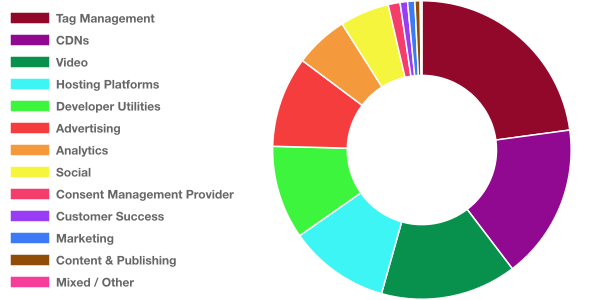

# Third Party Web

Data on third party entities and their impact on the web.

This document is a summary of which third party scripts are most responsible for excessive JavaScript execution on the web today.

## Table of Contents

1.  [Goals](#goals)
1.  [Methodology](#methodology)
1.  [NPM Module](#npm-module)
1.  [Updates](#updates)
1.  [Data](#data)
    1.  [Summary](#summary)
    1.  [How to Interpret](#how-to-interpret)
    1.  [Third Parties by Category](#by-category)
        1.  [Ads](#ad)
        1.  [Analytics](#analytics)
        1.  [Social](#social)
        1.  [Video](#video)
        1.  [Developer Utilities](#utility)
        1.  [Hosting Platforms](#hosting)
        1.  [Marketing](#marketing)
        1.  [Customer Success](#customer-success)
        1.  [Content & Publishing](#content)
        1.  [Libraries](#library)
        1.  [Mixed / Other](#other)
    1.  [Third Parties by Total Impact](#by-total-impact)
1.  [Future Work](#future-work)
1.  [FAQs](#faqs)
1.  [Contributing](#contributing)

## Goals

1.  Quantify the impact of third party scripts on the web.
1.  Identify the third party scripts on the web that have the greatest performance cost.
1.  Give developers the information they need to make informed decisions about which third parties to include on their sites.
1.  Incentivize responsible third party script behavior.
1.  Make this information accessible and useful.

## Methodology

[HTTP Archive](https://httparchive.org/) is an inititiave that tracks how the web is built. Twice a month, ~4 million sites are crawled with [Lighthouse](https://github.com/GoogleChrome/lighthouse) on mobile. Lighthouse breaks down the total script execution time of each page and attributes the execution to a URL. Using [BigQuery](https://cloud.google.com/bigquery/), this project aggregates the script execution to the origin-level and assigns each origin to the responsible entity.

## NPM Module

The entity classification data is available as an NPM module.

```js
const { getEntity } = require("third-party-web");
const entity = getEntity("https://d36mpcpuzc4ztk.cloudfront.net/js/visitor.js");
console.log(entity);
//   {
//     "name": "Freshdesk",
//     "homepage": "https://freshdesk.com/",
//     "categories": ["customer-success"],
//     "domains": ["d36mpcpuzc4ztk.cloudfront.net"]
//   }
```

## Updates

## 2019-02-01 dataset

Huge props to [WordAds](https://wordads.co/) for reducing their impact from ~2.5s to ~200ms on average! A few entities are showing considerably less data this cycle (Media Math, Crazy Egg, DoubleVerify, Bootstrap CDN). Perhaps they've added new CDNs/hostnames that we haven't identified or the basket of sites in HTTPArchive has shifted away from their usage.

## Data

### Summary

Across top ~1 million sites, ~800 origins account for ~65% of all script execution time with the top 100 entities already accounting for ~59%. Third party script execution is the majority chunk of the web today, and it's important to make informed choices.

### How to Interpret

Each entity has a number of data points available.

1.  **Usage (Total Number of Occurrences)** - how many scripts from their origins were included on pages
1.  **Total Impact (Total Execution Time)** - how many seconds were spent executing their scripts across the web
1.  **Average Impact (Average Execution Time)** - on average, how many milliseconds were spent executing each script
1.  **Category** - what type of script is this

<a name="by-category"></a>

### Third Parties by Category

This section breaks down third parties by category. The third parties in each category are ranked from first to last based on the average impact of their scripts. Perhaps the most important comparisons lie here. You always need to pick an analytics provider, but at least you can pick the most well-behaved analytics provider.

#### Overall Breakdown

Unsurprisingly, ads account for the largest identifiable chunk of third party script execution. Other balloons as a category primarily due to Google Tag Manager which is used to deliver scripts in multiple categories. Google Tag Manager script execution alone is responsible for more than half of the "Mixed / Other" category.



<a name="ad"></a>

#### Ads

These scripts are part of advertising networks, either serving or measuring.

| Rank | Name                                                           | Usage     | Average Impact |
| ---- | -------------------------------------------------------------- | --------- | -------------- |
| 1    | [Media Math](http://www.mediamath.com/)                        | 662       | 68 ms          |
| 2    | [Adroll](https://www.adroll.com/)                              | 3,198     | 94 ms          |
| 3    | [Amazon Ads](https://advertising.amazon.com/)                  | 22,090    | 94 ms          |
| 4    | [Scorecard Research](https://www.scorecardresearch.com/)       | 3,578     | 103 ms         |
| 5    | [Rubicon Project](https://rubiconproject.com/)                 | 3,905     | 106 ms         |
| 6    | [MGID](https://www.mgid.com/)                                  | 10,317    | 114 ms         |
| 7    | [Criteo](https://www.criteo.com/)                              | 64,547    | 116 ms         |
| 8    | [Market GID](https://www.marketgid.com/)                       | 3,873     | 153 ms         |
| 9    | [Taboola](https://www.taboola.com/)                            | 23,853    | 176 ms         |
| 10   | [Bing Ads](https://bingads.microsoft.com)                      | 1,103     | 208 ms         |
| 11   | [WordAds](https://wordads.co/)                                 | 32,295    | 212 ms         |
| 12   | [Google/Doubleclick Ads](https://www.doubleclickbygoogle.com/) | 1,206,843 | 215 ms         |
| 13   | [Pubmatic](https://pubmatic.com/)                              | 3,140     | 225 ms         |
| 14   | [Yahoo Ads](https://www.media.net/)                            | 9,578     | 225 ms         |
| 15   | [AppNexus](https://www.appnexus.com/)                          | 14,694    | 265 ms         |
| 16   | [Yandex Ads](https://yandex.com/adv/)                          | 39,330    | 272 ms         |
| 17   | [Integral Ads](https://integralads.com/uk/)                    | 24,532    | 305 ms         |
| 18   | [Sizmek](https://www.sizmek.com/)                              | 4,011     | 374 ms         |
| 19   | [DoubleVerify](https://www.doubleverify.com/)                  | 1,988     | 600 ms         |
| 20   | [MediaVine](https://www.mediavine.com/)                        | 9,801     | 706 ms         |
| 21   | [Moat](https://moat.com/)                                      | 14,337    | 708 ms         |
| 22   | [OpenX](https://www.openx.com/)                                | 10,729    | 836 ms         |
| 23   | [33 Across](https://33across.com/)                             | 20,137    | 863 ms         |
| 24   | [Popads](https://www.popads.net/)                              | 5,009     | 1288 ms        |

<a name="analytics"></a>

#### Analytics

These scripts measure or track users and their actions. There's a wide range in impact here depending on what's being tracked.

| Rank | Name                                                               | Usage     | Average Impact |
| ---- | ------------------------------------------------------------------ | --------- | -------------- |
| 1    | [Alexa](https://www.alexa.com/)                                    | 1,265     | 50 ms          |
| 2    | [Cedexis](https://www.cedexis.com/radar/)                          | 425       | 72 ms          |
| 3    | [Google Analytics](https://www.google.com/analytics/analytics/)    | 1,163,249 | 77 ms          |
| 4    | [Mixpanel](https://mixpanel.com/)                                  | 5,462     | 77 ms          |
| 5    | [Snowplow](https://snowplowanalytics.com/)                         | 2,492     | 77 ms          |
| 6    | [Baidu Analytics](https://tongji.baidu.com/web/welcome/login)      | 7,041     | 78 ms          |
| 7    | [Crazy Egg](https://www.crazyegg.com/)                             | 455       | 89 ms          |
| 8    | [Hotjar](https://www.hotjar.com/)                                  | 91,036    | 92 ms          |
| 9    | [VWO](https://vwo.com)                                             | 6,471     | 100 ms         |
| 10   | [Adobe Analytics](https://www.adobe.com/analytics-cloud.html)      | 32,173    | 183 ms         |
| 11   | [Segment](https://segment.com/)                                    | 6,998     | 201 ms         |
| 12   | [Tealium](https://tealium.com/)                                    | 14,422    | 207 ms         |
| 13   | [Optimizely](https://www.optimizely.com/)                          | 13,482    | 232 ms         |
| 14   | [Salesforce](https://www.salesforce.com/products/marketing-cloud/) | 40,868    | 270 ms         |
| 15   | [Yandex Metrica](https://metrica.yandex.com/about?)                | 221,577   | 356 ms         |
| 16   | [Histats](http://histats.com/)                                     | 14,706    | 390 ms         |
| 17   | [mPulse](https://developer.akamai.com/akamai-mpulse)               | 2,521     | 775 ms         |
| 18   | [Lucky Orange](https://www.luckyorange.com/)                       | 6,113     | 834 ms         |

<a name="social"></a>

#### Social

These scripts enable social features.

| Rank | Name                                                 | Usage     | Average Impact |
| ---- | ---------------------------------------------------- | --------- | -------------- |
| 1    | [VK](https://vk.com/)                                | 6,342     | 65 ms          |
| 2    | [Pinterest](https://pinterest.com/)                  | 14,331    | 87 ms          |
| 3    | [Facebook](https://www.facebook.com)                 | 1,107,461 | 116 ms         |
| 4    | [Yandex Share](https://yastatic.net/share2/share.js) | 29,555    | 128 ms         |
| 5    | [LinkedIn](https://www.linkedin.com/)                | 12,260    | 130 ms         |
| 6    | [Twitter](https://twitter.com)                       | 274,753   | 146 ms         |
| 7    | [ShareThis](https://www.sharethis.com/)              | 32,318    | 229 ms         |
| 8    | [Shareaholic](https://www.shareaholic.com/)          | 13,268    | 236 ms         |
| 9    | [AddThis](http://www.addthis.com/)                   | 170,036   | 245 ms         |
| 10   | [Tumblr](https://tumblr.com/)                        | 40,855    | 312 ms         |
| 11   | [Disqus](http://disqus.com/)                         | 741       | 504 ms         |
| 12   | [PIXNET](https://www.pixnet.net/)                    | 54,969    | 605 ms         |

<a name="video"></a>

#### Video

These scripts enable video player and streaming functionality.

| Rank | Name                                         | Usage  | Average Impact |
| ---- | -------------------------------------------- | ------ | -------------- |
| 1    | [YouTube](https://youtube.com)               | 22,093 | 107 ms         |
| 2    | [Wistia](https://wistia.com/)                | 20,633 | 257 ms         |
| 3    | [Brightcove](https://www.brightcove.com/en/) | 4,933  | 441 ms         |

<a name="utility"></a>

#### Developer Utilities

These scripts are developer utilities (API clients, site monitoring, fraud detection, etc).

| Rank | Name                                                               | Usage   | Average Impact |
| ---- | ------------------------------------------------------------------ | ------- | -------------- |
| 1    | [New Relic](https://newrelic.com/)                                 | 3,502   | 70 ms          |
| 2    | [Stripe](https://stripe.com)                                       | 4,751   | 70 ms          |
| 3    | [OneSignal](https://onesignal.com/)                                | 37,165  | 83 ms          |
| 4    | [Google APIs/SDK](https://developers.google.com/apis-explorer/#p/) | 829,509 | 114 ms         |
| 5    | [App Dynamics](https://www.appdynamics.com/)                       | 1,929   | 124 ms         |
| 6    | [Cloudflare](https://www.cloudflare.com/website-optimization/)     | 5,190   | 191 ms         |
| 7    | [PayPal](https://paypal.com)                                       | 6,467   | 229 ms         |
| 8    | [Yandex APIs](https://yandex.ru/)                                  | 57,870  | 362 ms         |
| 9    | [Distil Networks](https://www.distilnetworks.com/)                 | 11,313  | 376 ms         |
| 10   | [Sentry](https://sentry.io/)                                       | 15,981  | 686 ms         |

<a name="hosting"></a>

#### Hosting Platforms

These scripts are from web hosting platforms (WordPress, Wix, Squarespace, etc). Note that in this category, this can sometimes be the entirety of script on the page, and so the "impact" rank might be misleading. In the case of WordPress, this just indicates the libraries hosted and served _by_ WordPress not all sites using self-hosted WordPress.

| Rank | Name                                        | Usage   | Average Impact |
| ---- | ------------------------------------------- | ------- | -------------- |
| 1    | [Blogger](http://www.blogger.com/)          | 17,943  | 47 ms          |
| 2    | [Dealer](https://www.dealer.com/)           | 23,885  | 90 ms          |
| 3    | [WordPress](https://wp.com/)                | 126,052 | 122 ms         |
| 4    | [Shopify](https://www.shopify.com/)         | 220,676 | 158 ms         |
| 5    | [Weebly](https://www.weebly.com/)           | 35,097  | 230 ms         |
| 6    | [Hatena Blog](https://hatenablog.com/)      | 51,333  | 484 ms         |
| 7    | [Squarespace](https://www.squarespace.com/) | 87,878  | 491 ms         |
| 8    | [Wix](https://www.wix.com/)                 | 192,121 | 1040 ms        |

<a name="marketing"></a>

#### Marketing

These scripts are from marketing tools that add popups/newsletters/etc.

| Rank | Name                                        | Usage  | Average Impact |
| ---- | ------------------------------------------- | ------ | -------------- |
| 1    | [RD Station](https://www.rdstation.com/en/) | 2,517  | 70 ms          |
| 2    | [Hubspot](https://hubspot.com/)             | 14,148 | 91 ms          |
| 3    | [Listrak](https://www.listrak.com/)         | 963    | 128 ms         |
| 4    | [OptinMonster](https://optinmonster.com/)   | 1,129  | 132 ms         |
| 5    | [Beeketing](https://beeketing.com/)         | 61,179 | 138 ms         |
| 6    | [Drift](https://www.drift.com/)             | 4,073  | 141 ms         |
| 7    | [Mailchimp](https://mailchimp.com/)         | 22,992 | 146 ms         |
| 8    | [Sumo](https://sumo.com/)                   | 35,677 | 385 ms         |
| 9    | [Albacross](https://albacross.com/)         | 1,382  | 727 ms         |

<a name="customer-success"></a>

#### Customer Success

These scripts are from customer support/marketing providers that offer chat and contact solutions. These scripts are generally heavier in weight.

| Rank | Name                                     | Usage  | Average Impact |
| ---- | ---------------------------------------- | ------ | -------------- |
| 1    | [LiveChat](https://www.livechatinc.com/) | 20,433 | 87 ms          |
| 2    | [Freshdesk](https://freshdesk.com/)      | 909    | 140 ms         |
| 3    | [Help Scout](https://www.helpscout.net/) | 627    | 164 ms         |
| 4    | [Jivochat](https://www.jivochat.com/)    | 23,628 | 215 ms         |
| 5    | [Olark](https://www.olark.com/)          | 12,258 | 318 ms         |
| 6    | [Intercom](https://www.intercom.com/)    | 16,809 | 334 ms         |
| 7    | [Tawk.to](https://www.tawk.to/)          | 40,598 | 345 ms         |
| 8    | [ZenDesk](https://zendesk.com/)          | 32,852 | 421 ms         |
| 9    | [Zopim](https://www.zopim.com/)          | 53,503 | 607 ms         |

<a name="content"></a>

#### Content & Publishing

These scripts are from content providers or publishing-specific affiliate tracking.

| Rank | Name                                   | Usage  | Average Impact |
| ---- | -------------------------------------- | ------ | -------------- |
| 1    | [AMP](https://www.ampproject.org/)     | 61,086 | 199 ms         |
| 2    | [Vox Media](https://www.voxmedia.com/) | 704    | 456 ms         |
| 3    | [Hotmart](https://www.hotmart.com/)    | 854    | 785 ms         |

<a name="library"></a>

#### Libraries

These are mostly open source libraries (e.g. jQuery) served over different public CDNs. This category is unique in that the origin may have no responsibility for the performance of what's being served. Note that rank here does not imply one CDN is better than the other. It simply indicates that the libraries being served from that origin are lighter/heavier than the ones served by another..

| Rank | Name                                                         | Usage   | Average Impact |
| ---- | ------------------------------------------------------------ | ------- | -------------- |
| 1    | [Bootstrap CDN](https://www.bootstrapcdn.com/)               | 1,383   | 48 ms          |
| 2    | [FontAwesome CDN](https://fontawesome.com/)                  | 15,661  | 102 ms         |
| 3    | [Yandex CDN](https://yandex.ru/)                             | 2,020   | 123 ms         |
| 4    | [Adobe TypeKit](https://fonts.adobe.com/)                    | 4,519   | 131 ms         |
| 5    | [jQuery CDN](https://code.jquery.com/)                       | 142,889 | 170 ms         |
| 6    | [Google CDN](https://developers.google.com/speed/libraries/) | 744,534 | 177 ms         |
| 7    | [Cloudflare CDN](https://cdnjs.com/)                         | 101,203 | 193 ms         |
| 8    | [JSDelivr CDN](https://www.jsdelivr.com/)                    | 24,627  | 285 ms         |
| 9    | [CreateJS CDN](http://code.createjs.com/)                    | 1,757   | 3056 ms        |

<a name="other"></a>

#### Mixed / Other

These are miscellaneous scripts delivered via a shared origin with no precise category or attribution. Help us out by identifying more origins!

| Rank | Name                                                                          | Usage     | Average Impact |
| ---- | ----------------------------------------------------------------------------- | --------- | -------------- |
| 1    | [Amazon S3](https://aws.amazon.com/s3/)                                       | 32,205    | 156 ms         |
| 2    | [All Other 3rd Parties](#by-category)                                         | 1,326,341 | 204 ms         |
| 3    | [Ensighten](https://www.ensighten.com/)                                       | 6,753     | 249 ms         |
| 4    | [Google Tag Manager](https://marketingplatform.google.com/about/tag-manager/) | 1,098,396 | 431 ms         |
| 5    | [Parking Crew](http://parkingcrew.net/)                                       | 4,542     | 461 ms         |

<a name="by-total-impact"></a>

### Third Parties by Total Impact

This section highlights the entities responsible for the most script execution across the web. This helps inform which improvements would have the largest total impact.

| Name                                                                          | Popularity | Total Impact | Average Impact |
| ----------------------------------------------------------------------------- | ---------- | ------------ | -------------- |
| [Google Tag Manager](https://marketingplatform.google.com/about/tag-manager/) | 1,098,396  | 473,333 s    | 431 ms         |
| [All Other 3rd Parties](#by-category)                                         | 1,326,341  | 270,284 s    | 204 ms         |
| [Google/Doubleclick Ads](https://www.doubleclickbygoogle.com/)                | 1,206,843  | 259,963 s    | 215 ms         |
| [Wix](https://www.wix.com/)                                                   | 192,121    | 199,834 s    | 1040 ms        |
| [Google CDN](https://developers.google.com/speed/libraries/)                  | 744,534    | 131,849 s    | 177 ms         |
| [Facebook](https://www.facebook.com)                                          | 1,107,461  | 128,923 s    | 116 ms         |
| [Google APIs/SDK](https://developers.google.com/apis-explorer/#p/)            | 829,509    | 94,149 s     | 114 ms         |
| [Google Analytics](https://www.google.com/analytics/analytics/)               | 1,163,249  | 89,009 s     | 77 ms          |
| [Yandex Metrica](https://metrica.yandex.com/about?)                           | 221,577    | 78,814 s     | 356 ms         |
| [Squarespace](https://www.squarespace.com/)                                   | 87,878     | 43,179 s     | 491 ms         |
| [AddThis](http://www.addthis.com/)                                            | 170,036    | 41,730 s     | 245 ms         |
| [Twitter](https://twitter.com)                                                | 274,753    | 40,120 s     | 146 ms         |
| [Shopify](https://www.shopify.com/)                                           | 220,676    | 34,854 s     | 158 ms         |
| [PIXNET](https://www.pixnet.net/)                                             | 54,969     | 33,257 s     | 605 ms         |
| [Zopim](https://www.zopim.com/)                                               | 53,503     | 32,501 s     | 607 ms         |
| [Hatena Blog](https://hatenablog.com/)                                        | 51,333     | 24,848 s     | 484 ms         |
| [jQuery CDN](https://code.jquery.com/)                                        | 142,889    | 24,222 s     | 170 ms         |
| [Yandex APIs](https://yandex.ru/)                                             | 57,870     | 20,926 s     | 362 ms         |
| [Cloudflare CDN](https://cdnjs.com/)                                          | 101,203    | 19,548 s     | 193 ms         |
| [33 Across](https://33across.com/)                                            | 20,137     | 17,375 s     | 863 ms         |
| [WordPress](https://wp.com/)                                                  | 126,052    | 15,390 s     | 122 ms         |
| [Tawk.to](https://www.tawk.to/)                                               | 40,598     | 14,007 s     | 345 ms         |
| [ZenDesk](https://zendesk.com/)                                               | 32,852     | 13,839 s     | 421 ms         |
| [Sumo](https://sumo.com/)                                                     | 35,677     | 13,749 s     | 385 ms         |
| [Tumblr](https://tumblr.com/)                                                 | 40,855     | 12,755 s     | 312 ms         |
| [AMP](https://www.ampproject.org/)                                            | 61,086     | 12,136 s     | 199 ms         |
| [Salesforce](https://www.salesforce.com/products/marketing-cloud/)            | 40,868     | 11,025 s     | 270 ms         |
| [Sentry](https://sentry.io/)                                                  | 15,981     | 10,966 s     | 686 ms         |
| [Yandex Ads](https://yandex.com/adv/)                                         | 39,330     | 10,689 s     | 272 ms         |
| [Moat](https://moat.com/)                                                     | 14,337     | 10,154 s     | 708 ms         |
| [OpenX](https://www.openx.com/)                                               | 10,729     | 8,974 s      | 836 ms         |
| [Beeketing](https://beeketing.com/)                                           | 61,179     | 8,473 s      | 138 ms         |
| [Hotjar](https://www.hotjar.com/)                                             | 91,036     | 8,395 s      | 92 ms          |
| [Weebly](https://www.weebly.com/)                                             | 35,097     | 8,062 s      | 230 ms         |
| [Criteo](https://www.criteo.com/)                                             | 64,547     | 7,496 s      | 116 ms         |
| [Integral Ads](https://integralads.com/uk/)                                   | 24,532     | 7,477 s      | 305 ms         |
| [ShareThis](https://www.sharethis.com/)                                       | 32,318     | 7,405 s      | 229 ms         |
| [JSDelivr CDN](https://www.jsdelivr.com/)                                     | 24,627     | 7,007 s      | 285 ms         |
| [MediaVine](https://www.mediavine.com/)                                       | 9,801      | 6,915 s      | 706 ms         |
| [WordAds](https://wordads.co/)                                                | 32,295     | 6,844 s      | 212 ms         |
| [Popads](https://www.popads.net/)                                             | 5,009      | 6,451 s      | 1288 ms        |
| [Adobe Analytics](https://www.adobe.com/analytics-cloud.html)                 | 32,173     | 5,885 s      | 183 ms         |
| [Histats](http://histats.com/)                                                | 14,706     | 5,739 s      | 390 ms         |
| [Intercom](https://www.intercom.com/)                                         | 16,809     | 5,614 s      | 334 ms         |
| [CreateJS CDN](http://code.createjs.com/)                                     | 1,757      | 5,370 s      | 3056 ms        |
| [Wistia](https://wistia.com/)                                                 | 20,633     | 5,294 s      | 257 ms         |
| [Lucky Orange](https://www.luckyorange.com/)                                  | 6,113      | 5,098 s      | 834 ms         |
| [Jivochat](https://www.jivochat.com/)                                         | 23,628     | 5,084 s      | 215 ms         |
| [Amazon S3](https://aws.amazon.com/s3/)                                       | 32,205     | 5,008 s      | 156 ms         |
| [Distil Networks](https://www.distilnetworks.com/)                            | 11,313     | 4,254 s      | 376 ms         |
| [Taboola](https://www.taboola.com/)                                           | 23,853     | 4,190 s      | 176 ms         |
| [Olark](https://www.olark.com/)                                               | 12,258     | 3,902 s      | 318 ms         |
| [AppNexus](https://www.appnexus.com/)                                         | 14,694     | 3,888 s      | 265 ms         |
| [Yandex Share](https://yastatic.net/share2/share.js)                          | 29,555     | 3,772 s      | 128 ms         |
| [Mailchimp](https://mailchimp.com/)                                           | 22,992     | 3,357 s      | 146 ms         |
| [Shareaholic](https://www.shareaholic.com/)                                   | 13,268     | 3,135 s      | 236 ms         |
| [Optimizely](https://www.optimizely.com/)                                     | 13,482     | 3,135 s      | 232 ms         |
| [OneSignal](https://onesignal.com/)                                           | 37,165     | 3,075 s      | 83 ms          |
| [Tealium](https://tealium.com/)                                               | 14,422     | 2,990 s      | 207 ms         |
| [YouTube](https://youtube.com)                                                | 22,093     | 2,370 s      | 107 ms         |
| [Brightcove](https://www.brightcove.com/en/)                                  | 4,933      | 2,173 s      | 441 ms         |
| [Yahoo Ads](https://www.media.net/)                                           | 9,578      | 2,158 s      | 225 ms         |
| [Dealer](https://www.dealer.com/)                                             | 23,885     | 2,158 s      | 90 ms          |
| [Parking Crew](http://parkingcrew.net/)                                       | 4,542      | 2,093 s      | 461 ms         |
| [Amazon Ads](https://advertising.amazon.com/)                                 | 22,090     | 2,079 s      | 94 ms          |
| [mPulse](https://developer.akamai.com/akamai-mpulse)                          | 2,521      | 1,953 s      | 775 ms         |
| [LiveChat](https://www.livechatinc.com/)                                      | 20,433     | 1,786 s      | 87 ms          |
| [Ensighten](https://www.ensighten.com/)                                       | 6,753      | 1,683 s      | 249 ms         |
| [FontAwesome CDN](https://fontawesome.com/)                                   | 15,661     | 1,599 s      | 102 ms         |
| [LinkedIn](https://www.linkedin.com/)                                         | 12,260     | 1,594 s      | 130 ms         |
| [Sizmek](https://www.sizmek.com/)                                             | 4,011      | 1,501 s      | 374 ms         |
| [PayPal](https://paypal.com)                                                  | 6,467      | 1,478 s      | 229 ms         |
| [Segment](https://segment.com/)                                               | 6,998      | 1,406 s      | 201 ms         |
| [Hubspot](https://hubspot.com/)                                               | 14,148     | 1,287 s      | 91 ms          |
| [Pinterest](https://pinterest.com/)                                           | 14,331     | 1,245 s      | 87 ms          |
| [DoubleVerify](https://www.doubleverify.com/)                                 | 1,988      | 1,193 s      | 600 ms         |
| [MGID](https://www.mgid.com/)                                                 | 10,317     | 1,174 s      | 114 ms         |
| [Albacross](https://albacross.com/)                                           | 1,382      | 1,004 s      | 727 ms         |
| [Cloudflare](https://www.cloudflare.com/website-optimization/)                | 5,190      | 989 s        | 191 ms         |
| [Blogger](http://www.blogger.com/)                                            | 17,943     | 839 s        | 47 ms          |
| [Pubmatic](https://pubmatic.com/)                                             | 3,140      | 707 s        | 225 ms         |
| [Hotmart](https://www.hotmart.com/)                                           | 854        | 670 s        | 785 ms         |
| [VWO](https://vwo.com)                                                        | 6,471      | 649 s        | 100 ms         |
| [Market GID](https://www.marketgid.com/)                                      | 3,873      | 592 s        | 153 ms         |
| [Adobe TypeKit](https://fonts.adobe.com/)                                     | 4,519      | 590 s        | 131 ms         |
| [Drift](https://www.drift.com/)                                               | 4,073      | 575 s        | 141 ms         |
| [Baidu Analytics](https://tongji.baidu.com/web/welcome/login)                 | 7,041      | 550 s        | 78 ms          |
| [Mixpanel](https://mixpanel.com/)                                             | 5,462      | 420 s        | 77 ms          |
| [VK](https://vk.com/)                                                         | 6,342      | 414 s        | 65 ms          |
| [Rubicon Project](https://rubiconproject.com/)                                | 3,905      | 413 s        | 106 ms         |
| [Disqus](http://disqus.com/)                                                  | 741        | 374 s        | 504 ms         |
| [Scorecard Research](https://www.scorecardresearch.com/)                      | 3,578      | 369 s        | 103 ms         |
| [Stripe](https://stripe.com)                                                  | 4,751      | 334 s        | 70 ms          |
| [Vox Media](https://www.voxmedia.com/)                                        | 704        | 321 s        | 456 ms         |
| [Adroll](https://www.adroll.com/)                                             | 3,198      | 301 s        | 94 ms          |
| [Yandex CDN](https://yandex.ru/)                                              | 2,020      | 249 s        | 123 ms         |
| [New Relic](https://newrelic.com/)                                            | 3,502      | 244 s        | 70 ms          |
| [App Dynamics](https://www.appdynamics.com/)                                  | 1,929      | 240 s        | 124 ms         |
| [Bing Ads](https://bingads.microsoft.com)                                     | 1,103      | 230 s        | 208 ms         |
| [Snowplow](https://snowplowanalytics.com/)                                    | 2,492      | 193 s        | 77 ms          |
| [RD Station](https://www.rdstation.com/en/)                                   | 2,517      | 176 s        | 70 ms          |
| [OptinMonster](https://optinmonster.com/)                                     | 1,129      | 149 s        | 132 ms         |
| [Freshdesk](https://freshdesk.com/)                                           | 909        | 127 s        | 140 ms         |
| [Listrak](https://www.listrak.com/)                                           | 963        | 123 s        | 128 ms         |
| [Help Scout](https://www.helpscout.net/)                                      | 627        | 103 s        | 164 ms         |
| [Bootstrap CDN](https://www.bootstrapcdn.com/)                                | 1,383      | 67 s         | 48 ms          |
| [Alexa](https://www.alexa.com/)                                               | 1,265      | 63 s         | 50 ms          |
| [Media Math](http://www.mediamath.com/)                                       | 662        | 45 s         | 68 ms          |
| [Crazy Egg](https://www.crazyegg.com/)                                        | 455        | 41 s         | 89 ms          |
| [Cedexis](https://www.cedexis.com/radar/)                                     | 425        | 31 s         | 72 ms          |

## Future Work

1.  Introduce URL-level data for more fine-grained analysis, i.e. which libraries from Cloudflare/Google CDNs are most expensive.
1.  Expand the scope, i.e. include more third parties and have greater entity/category coverage.

## FAQs

### I don't see entity X in the list. What's up with that?

This can be for one of several reasons:

1.  The entity does not have at least 100 references to their origin in the dataset.
1.  The entity's origins have not yet been identified. See [How can I contribute?](#contribute)

### How is the "Average Impact" determined?

The HTTP Archive dataset includes Lighthouse reports for each URL on mobile. Lighthouse has an audit called "bootup-time" that summarizes the amount of time that each script spent on the main thread. The "Average Impact" for an entity is the total execution time of scripts whose domain matches one of the entity's domains divided by the total number of occurences of those scripts.

```
Average Impact = Total Execution Time / Total Occurences
```

### How does Lighthouse determine the execution time of each script?

Lighthouse's bootup time audit attempts to attribute all toplevel main-thread tasks to a URL. A main thread task is attributed to the first script URL found in the stack. If you're interested in helping us improve this logic, see [Contributing](#contributing) for details.

### The data for entity X seems wrong. How can it be corrected?

Verify that the origins in `data/entities.json` are correct. Most issues will simply be the result of mislabelling of shared origins. If everything checks out, there is likely no further action and the data is valid. If you still believe there's errors, file an issue to discuss futher.

<a name="contribute"></a>

### How can I contribute?

Only about 90% of the third party script execution has been assigned to an entity. We could use your help identifying the rest! See [Contributing](#contributing) for details.

## Contributing

### Updating the Entities

The domain->entity mapping can be found in `data/entities.json`. Adding a new entity is as simple as adding a new array item with the following form.

```js
{
    "name": "Facebook",
    "homepage": "https://www.facebook.com",
    "categories": ["social"],
    "domains": [
        "www.facebook.com",
        "connect.facebook.net",
        "staticxx.facebook.com",
        "static.xx.fbcdn.net",
        "m.facebook.com"
    ]
}
```

### Updating Attribution Logic

The logic for attribution to individual script URLs can be found in the [Lighthouse repo](https://github.com/GoogleChrome/lighthouse). File an issue over there to discuss further.

### Updating the Data

The query used to compute the origin-level data is in `sql/origin-execution-time-query.sql`, running this against the latest Lighthouse HTTP Archive should give you a JSON export of the latest data that can be checked in at `data/YYYY-MM-DD-origin-scripting.json`.

### Updating this README

This README is auto-generated from the templates `lib/` and the computed data. In order to update the charts, you'll need to make sure you have `cairo` installed locally in addition to `yarn install`.

```bash
# Install `cairo` and dependencies for node-canvas
brew install pkg-config cairo pango libpng jpeg giflib
```
